# 计算机系统基础 PA1
**姓名：**  刘宇泽  
**学号：**  2411334
## 概述
### 实验目的
- 熟悉 GNU/Linux 平台 
- 初步探究“程序在计算机上运行”的相关原理 
- 初步学习 GDB 并在 PA 上实现简易调试器
### 实验内容
- 阶段一：模拟寄存器结构，实现调试器基本功能。 
- 阶段二：实现调试功能的表达式求值，并完善阶段一中的扫描内存函数。
- 阶段三：实现调试功能中的监视点，学习断点相关知识与 i386 手册。
## 阶段一
### nemu执行流程
阅读nemu/src/main.c,NEMU首先通过`init_monitor(argc,argv)`完成相关初始化工作
```c
int init_monitor(int argc, char *argv[]) {
  /* 执行一些全局初始化操作 */
  /* 解析命令行参数 */
  parse_args(argc, argv);
  /* 打开日志文件 */
  init_log();
  /* 测试 `CPU_state' 结构体的实现 */
  reg_test();
#ifdef DIFF_TEST
  /* 创建子进程以执行差分测试 */
  init_difftest();
#endif
  /* 将镜像加载到内存 */
  load_img();
  /* 初始化虚拟计算机系统 */
  restart();
  /* 编译正则表达式 */
  init_regex();
  /* 初始化监视点池 */
  init_wp_pool();
  /* 初始化设备 */
  init_device();
  /* 显示欢迎信息 */
  welcome();
  return is_batch_mode;
}

```
### 实现正确寄存器结构体
#### 结构体与函数介绍
- 寄存器结构：除程序计数器eip外，32位、16位、8位寄存器各8个
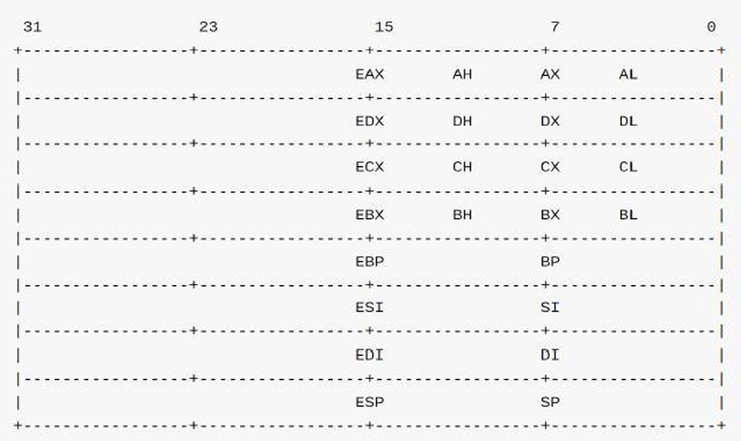
- Union 结构: Union中的各变量互斥，共享同一内存首地址，寄存器的结构实现就
是基于该特性实现的。
- reg_test() 函数：寄存器测试函数
```c
void reg_test() {
  srand(time(0));
  uint32_t sample[8];
  uint32_t eip_sample = rand();
  cpu.eip = eip_sample;

  int i;
  for (i = R_EAX; i <= R_EDI; i ++) {
    sample[i] = rand();
    reg_l(i) = sample[i];
    assert(reg_w(i) == (sample[i] & 0xffff));
  }

  assert(reg_b(R_AL) == (sample[R_EAX] & 0xff));
  assert(reg_b(R_AH) == ((sample[R_EAX] >> 8) & 0xff));
  assert(reg_b(R_BL) == (sample[R_EBX] & 0xff));
  assert(reg_b(R_BH) == ((sample[R_EBX] >> 8) & 0xff));
  assert(reg_b(R_CL) == (sample[R_ECX] & 0xff));
  assert(reg_b(R_CH) == ((sample[R_ECX] >> 8) & 0xff));
  assert(reg_b(R_DL) == (sample[R_EDX] & 0xff));
  assert(reg_b(R_DH) == ((sample[R_EDX] >> 8) & 0xff));

  assert(sample[R_EAX] == cpu.eax);
  assert(sample[R_ECX] == cpu.ecx);
  assert(sample[R_EDX] == cpu.edx);
  assert(sample[R_EBX] == cpu.ebx);
  assert(sample[R_ESP] == cpu.esp);
  assert(sample[R_EBP] == cpu.ebp);
  assert(sample[R_ESI] == cpu.esi);
  assert(sample[R_EDI] == cpu.edi);

  assert(eip_sample == cpu.eip);
}
```
该测试函数主要为两个部分：
 - 检验 32、16、8 位寄存器满足图片所示的寄存器结构。
 - 确保可直接通过寄存器名访问 32 位寄存器的内容。
#### 代码实现
- 修改nemu/include/cpu/reg.h
```c
#ifndef __REG_H__
#define __REG_H__
#include "common.h"
enum { R_EAX, R_ECX, R_EDX, R_EBX, R_ESP, R_EBP, R_ESI, R_EDI };
enum { R_AX, R_CX, R_DX, R_BX, R_SP, R_BP, R_SI, R_DI };
enum { R_AL, R_CL, R_DL, R_BL, R_AH, R_CH, R_DH, R_BH };
typedef struct {
  union {
    union {
      uint32_t _32;
      uint16_t _16;
      uint8_t _8[2];
    } gpr[8];
    /* Do NOT change the order of the GPRs' definitions. */
    /* 与gpr[0]-gpr[7]一一对应，共享同一块内存空间 */
    struct {
      rtlreg_t eax, ecx, edx, ebx, esp, ebp, esi, edi;
    };
  };
  vaddr_t eip;
} CPU_state;
extern CPU_state cpu;
static inline int check_reg_index(int index) {
  assert(index >= 0 && index < 8);
  return index;
}
#define reg_l(index) (cpu.gpr[check_reg_index(index)]._32)
#define reg_w(index) (cpu.gpr[check_reg_index(index)]._16)
#define reg_b(index) (cpu.gpr[check_reg_index(index) & 0x3]._8[index >> 2])
extern const char* regsl[];
extern const char* regsw[];
extern const char* regsb[];
static inline const char* reg_name(int index, int width) {
  assert(index >= 0 && index < 8);
  switch (width) {
    case 4: return regsl[index];
    case 1: return regsb[index];
    case 2: return regsw[index];
    default: assert(0);
  }
}
#endif
```
#### 运行结果
输入 make run，成功输出 welcome
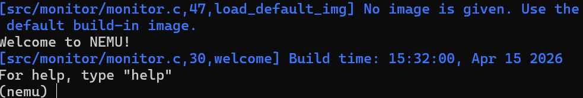
#### 问题：究竟要执行多久
打开nemu/src/monitor/cpu-exec.c，查看`cpu_exec()`函数的实现，发现函数模仿CPU的工作方式，不断执行n条指令，直到指令执行完毕或进入nemu_trap，才退出指令执行的循环。
```c
/* Simulate how the CPU works. */
void cpu_exec(uint64_t n) {
  if (nemu_state == NEMU_END) {
    printf("Program execution has ended. To restart the program, exit NEMU and run again.\n");
    return;
  }
  nemu_state = NEMU_RUNNING;

  bool print_flag = n < MAX_INSTR_TO_PRINT;

  for (; n > 0; n --) {
    /* Execute one instruction, including instruction fetch,
     * instruction decode, and the actual execution. */
    exec_wrapper(print_flag);

#ifdef DEBUG
    /* TODO: check watchpoints here. */

#endif

#ifdef HAS_IOE
    extern void device_update();
    device_update();
#endif

    if (nemu_state != NEMU_RUNNING) { return; }
  }

  if (nemu_state == NEMU_RUNNING) { nemu_state = NEMU_STOP; }
}
```
所以传入-1即uint64_t 中的2^64-1，就算 CPU 每秒执行 10 亿条指令，跑满这个数也需要 约 5800 亿年（远超宇宙年龄），对我们的程序来说，等价于「无限执行」。
所以当你输入 c（continue）命令时，NEMU 会给 cpu_exec 传 -1，让程序一直跑，直到遇到 nemu_trap 指令，才会退出执行循环。
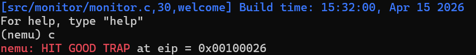
#### 问题：谁来指示程序的结束
##### 实验一：写一个普通的C程序（验证main返回会退出）
```c
#include <stdio.h>
int main() {
    printf("Hello from main()\n");
    return 0; // main 返回
}
```
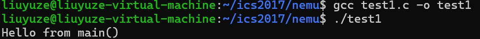
**现象：**程序打印 Hello from main() 后正常退出，符合课上认知。
##### 实验二：核main() 不返回，程序也能退出（exit() 才是关键）
```c
#include <stdio.h>
#include <stdlib.h> 
int main() {
    printf("Hello from main()\n");
    exit(0); 
    printf("This line will never print\n"); // 死代码
}
```
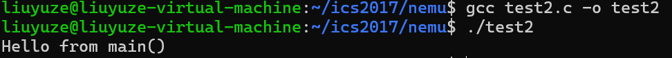
**现象：**
- 只打印 Hello from main()，第二行永远不会执行
- 程序正常退出，说明 **main() 不需要返回，程序也能结束 **，exit() 才是真正的退出触发点
##### 实验三：跳过 main()，直接看程序入口
```c
#include <stdio.h>
#include <stdlib.h>
// 自定义入口，替代运行时库的 _start
void _start() {
    printf("Hello from _start (real entry)\n");
    exit(0); // 直接退出，完全不经过 main()
}
```
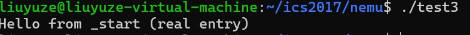
**现象：**
- 程序正常打印 Hello from _start (real entry) 并退出
- 完全没有 main() 函数，证明 main() 不是程序的必须入口，只是运行时库的一个调用目标 
### 基础设施：简易调试器
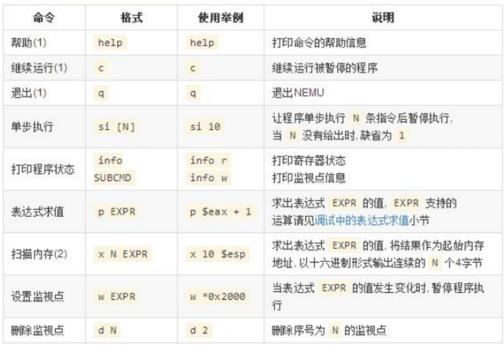
### 代码实现
修改nemu/src/monitor/debug/ui.c
#### 单步执行
- cpu_exec(uint64_t n)函数模拟 CPU 的工作方式，执行n条指令，单步执行命令只需简单调
用该函数即可
```c
static int cmd_si(char *args) {
  uint64_t N=0;
  if(args==NULL)
      N=1;
  else{
      int nRet=sscanf(args,"%llu",&N);
      if(nRet<=0){
          printf("args error in cmd_si\n");
          return 0;
      }
  }
  cpu_exec(N);
  return 0;
}
```
**测试**
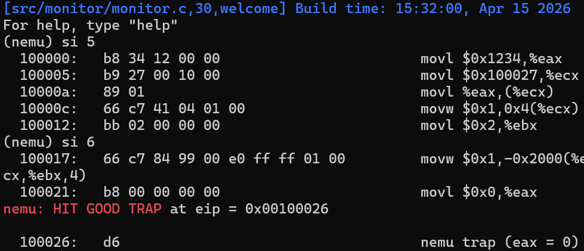
#### 打印寄存器
- 通过`regsl[i]` / `regsw[i]` / `regsb[i]`调用`reg_l(i)` / `reg_w(i)` / `reg_b(i)`函数实现寄存器的读取"args error in cmd_info\n"
```c
static int cmd_info(char *args) {
   char s;
   if(args == NULL){
    printf("args error in cmd_info\n");
     return 0;
   }
   int nRet = sscanf(args, "%c", &s);
   if(nRet <= 0){
     printf("args error in cmd_info\n");
     return 0;
   }
   if(s == 'r'){
     int i;
     for(i=0; i<8; i++)
       printf("%s\t0x%x\n", regsl[i], reg_l(i));
     printf("eip\t0x%x\n", cpu.eip);
     for(i=0; i<8; i++)
       printf("%s\t0x%x\n", regsw[i], reg_w(i));
     for(i=0; i<8; i++)
       printf("%s\t0x%x\n", regsb[i], reg_b(i));
     return 0;
   }
   printf("args error in cmd_info\n");
   return 0;
 }
```
**测试**
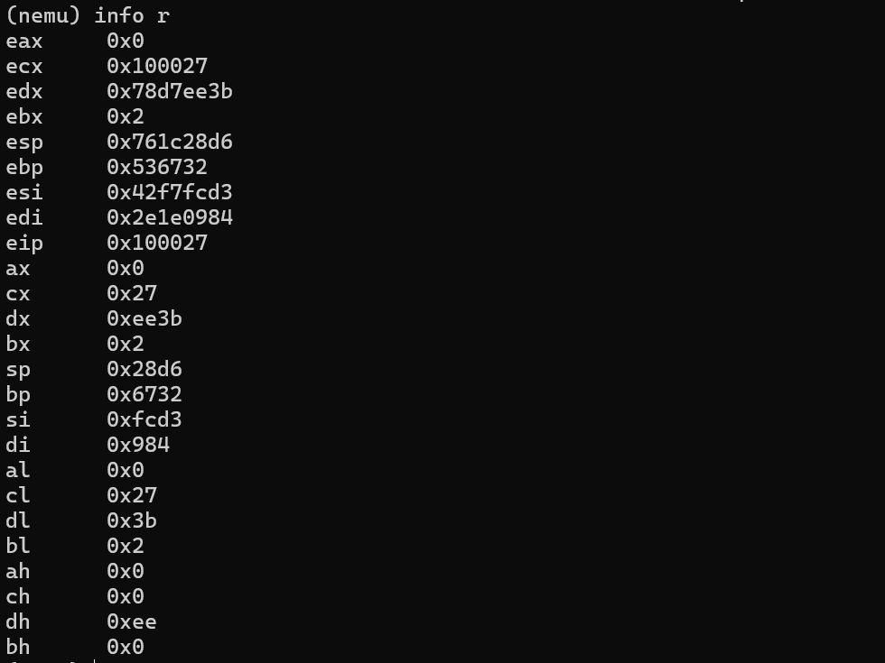
#### 扫描内存
- 通过 `vaddr_read` 函数 读取 4 字节内存数据，将 32 位数据拆分为 4 个字节，按「地址 + 32 位值 + 逐字节十六进制」的格式打印，每轮循环后地址自增 4 字节，最终完成指定范围内存的可视化输出。
```c
static int cmd_x(char *args) {
  if(!args){
      printf("args error in cmd_si\n");
      return 0;
  }
  char* args_end= args + strlen(args),*first_args=strtok(args," ");
  if(!first_args){
      printf("args error in cmd_si\n");
      return 0;
  }
  char *exprs=first_args+strlen(first_args)+1;
  if(exprs>=args_end){
      printf("args error in cmd_si\n");
      return 0;
  }
  int n=atoi(first_args);
  bool success;
  vaddr_t addr=expr(exprs,&success);
  if(success==false)
      printf("error in expr()\n");
  printf("Memory:");
  printf("\n");
  for(int i=0;i<n;i++){
      printf("0x%x:",addr);
      uint32_t val=vaddr_read(addr,4);
      uint8_t *by =(uint8_t *)&val;
      printf("0x");
      for(int j=3;j>=0;j--)
          printf("%02x",by[j]);
      printf("\n");
      addr+=4;
  }
  return 0;
}
```
**测试**
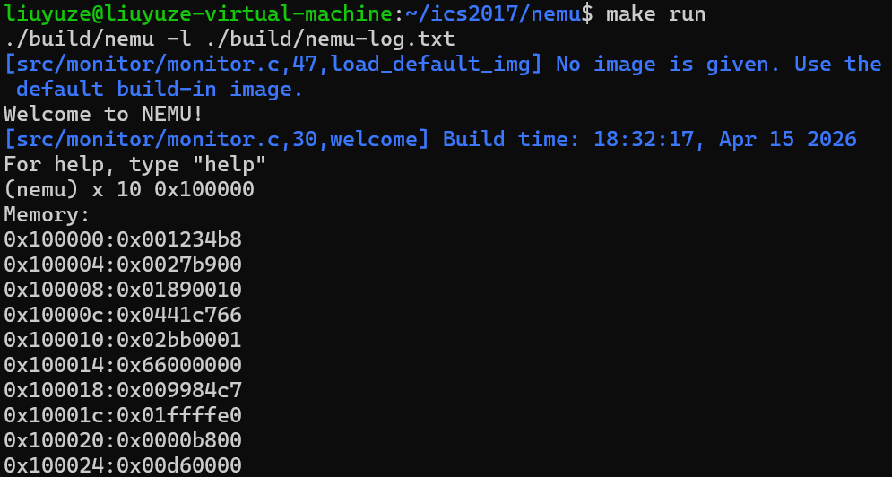
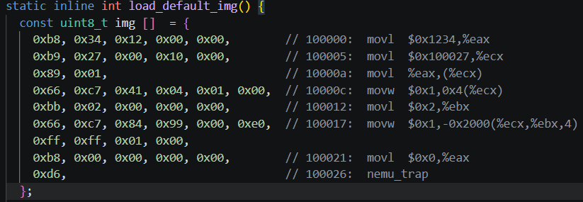
镜像对比验证正确
## 阶段二
### 实现算术表达式词法分析
#### 相关变量与函数
1. 枚举：Token 类型编码
```c
enum {
  TK_NOTYPE = 256,  
  TK_EQ           
};
```
- 作用：为所有 Token 分配唯一标识 ID
- 基础 ASCII 字符（+）直接用 ASCII 值；多字符运算符（==）用自定义枚举值
2. 规则结构体：正则匹配规则表
```c
static struct rule {
  char *regex;
  int token_type;
} rules[] = {
  {" +", TK_NOTYPE},    // spaces
  {"\\+", '+'},         // plus
  {"==", TK_EQ}         // equal
};
```
- 作用：定义词法规则，是词法分析的依据
3. make_token()：词法分析核心函数
- 函数功能：将输入字符串 → Token 序列（词法分析）
#### 代码实现
- 修改nemu/src/monitor/debug/expr.c
1. 实现token的定义与声明
```c
enum {
  TK_NOTYPE = 256,
  TK_NUMBER,
  TK_HEX,
  TK_REG,
  TK_EQ,
  TK_NEQ,
  TK_AND,
  TK_OR,
  TK_NEGATIVE,
  TK_DEREF
};
```
```c
static struct rule {
  char *regex;
  int token_type;
} rules[] = {
  {" +", TK_NOTYPE},
  {"0x[1-9A-Fa-f][0-9A-Fa-f]*", TK_HEX},
  {"[0-9][0-9]*", TK_NUMBER},
  {"\\$(eax|ecx|edx|ebx|esp|ebp|esi|edi|eip|ax|cx|dx|bx|sp|bp|si|di|al|cl|dl|bl|ah|ch|dh|bh)", TK_REG},
  {"==", TK_EQ},
  {"!=", TK_NEQ},
  {"&&", TK_AND},
  {"\\|\\|", TK_OR},
  {"!", '!'},
  {"\\+", '+'},
  {"-", '-'},
  {"\\*", '*'},
  {"\\/", '/'},
  {"\\(", '('},
  {")", ')'}
};
```
2. 在make_token 函数中进行处理
```c
static bool make_token(char *e) {
  int pos = 0;
  regmatch_t pm;
  nr_token = 0;
  while (e[pos] != '\0') {
    int i;
    for (i = 0; i < NR_REGEX; i++) {
      if (regexec(&re[i], e + pos, 1, &pm, 0) == 0 && pm.rm_so == 0) {
        int len = pm.rm_eo;
        if (rules[i].token_type == TK_NOTYPE) { pos += len; break; }
        tokens[nr_token].type = rules[i].token_type;
        strncpy(tokens[nr_token].str, e + pos, len);
        tokens[nr_token].str[len] = '\0';
        nr_token++;
        pos += len;
        break;
      }
    }
    if (i == NR_REGEX) return false;
  }
  return true;
}
```
**功能：**
词法分析入口函数，将输入的表达式字符串逐字符扫描、正则匹配，切割为标准化 Token 序列，完成字符串→语义单元的转换。
**核心思路：**
1. **逐字符扫描：**从表达式起始位置开始，依次匹配所有正则规则；
2. **最长匹配原则：**匹配到有效子串后，直接跳过该段字符，继续扫描剩余内容；
3. **特殊处理：
    - 空格：直接跳过，不影响 Token 序列
    - 寄存器去除开头`$`，仅保留寄存器名称（如$eax→eax）
    - 严格校验 Token 长度，防止字符串溢出
4. **错误处理：**无匹配规则时，打印错误位置并返回失败，标识非法表达式。
### 实现算数表达式递归求值、带有负数的算术表达式求值、更复杂的表达式求值
#### 代码实现
**括号匹配检查：check_parentheses()**
```c
static bool check_parentheses(int p, int q) {
  if (tokens[p].type != '(' || tokens[q].type != ')') return false;
  int cnt = 0;
  for (int i = p; i <= q; i++) {
    if (tokens[i].type == '(') cnt++;
    if (tokens[i].type == ')') cnt--;
    if (cnt < 0) return false;
  }
  return cnt == 0;
}
```
**功能：**
判断 Token 区间[p,q]是否被一对最外层、完全匹配的括号包裹。
**核心思路：**
1. **采用计数器模拟栈：**左括号+1，右括号-1；
2. 遍历结束计数器为 0，且过程中不为负，匹配；
3. 是递归下降算法处理括号的核心判断条件，决定是否剥离括号。
   
---
**运算符优先级：get_pri()**
```c
static int get_pri(int op) {
  switch (op) {
    case TK_DEREF: case TK_NEGATIVE: case '!': return 4; /* 单目（最高）*/
    case '*': case '/': return 3;                       /* 乘除 */
    case '+': case '-': return 2;                       /* 加减 */
    case TK_EQ: case TK_NEQ: return 1;                  /* 比较 */
    case TK_AND: return 0; case TK_OR: return -1;       /* 逻辑（最低）*/
    default: return -2;
  }
}
```
**功能：**
定义所有运算符的优先级数值，数值越大优先级越高，决定运算执行顺序。
**核心思路：**
1. **严格遵循C 语言运算符优先级标准：**单目运算符 > 算术乘除 > 算术加减 > 比较运算 > 逻辑运算；
2. 单目运算符（负号、解引用、非）优先级最高，保证优先计算；
3. 优先级数值为整数，便于比较大小，实现主运算符查找。

---
**主运算符查找：find_dominant_op()**
```c
static int find_dominant_op(int p, int q) {
  int cnt = 0;
  int min_pri = 100, pos = -1;
  for (int i = p; i <= q; i++) {
    if (tokens[i].type == '(') cnt++;
    if (tokens[i].type == ')') cnt--;
    if (cnt != 0) continue;
    int t = tokens[i].type;
    if (t == TK_NEGATIVE || t == TK_DEREF || t == '!') continue;
    int pri = get_pri(t);
    if (pri < 0) continue;
    if (pri <= min_pri) {
      min_pri = pri;
      pos = i;
    }
  }
  if (pos == -1) {
    for (int i = p; i <= q; i++) {
      if (tokens[i].type == '(') cnt++;
      if (tokens[i].type == ')') cnt--;
      if (cnt != 0) continue;
      if (tokens[i].type == TK_NEGATIVE || tokens[i].type == TK_DEREF || tokens[i].type == '!') {
        return i;
      }
    }
  }
  return pos;
}
```
**功能：**
**递归下降算法核心：**在 Token 区间[p,q]中，查找最外层、优先级最低的运算符（主运算符）。
**核心思路：**
1. **跳过括号内部：**括号内的运算符优先级更高，不参与当前层主运算符查找；
2. **最低优先级优先：**主运算符是最后执行的运算符，对应优先级最低；
3. **左结合性：**相同优先级时，取右侧运算符，符合 C 语言左结合规则；
4. 找到主运算符后，表达式可分裂为左、右两个子表达式，实现递归求解。

---
**表达式求值核心函数：eval()**
```c
static uint32_t eval(int p, int q, bool *success) {
  if (!*success || p > q) { *success = false; return 0; }
  if (p == q) {
    switch (tokens[p].type) {
      case TK_NUMBER: return atoi(tokens[p].str);
      case TK_HEX: { uint32_t v; sscanf(tokens[p].str, "%x", &v); return v; }
      case TK_REG: {
        if (!strcmp(tokens[p].str, "$eip")) return cpu.eip;
        if (!strcmp(tokens[p].str, "$eax")) return reg_l(0);
        if (!strcmp(tokens[p].str, "$ecx")) return reg_l(1);
        if (!strcmp(tokens[p].str, "$edx")) return reg_l(2);
        if (!strcmp(tokens[p].str, "$ebx")) return reg_l(3);
        if (!strcmp(tokens[p].str, "$esp")) return reg_l(4);
        if (!strcmp(tokens[p].str, "$ebp")) return reg_l(5);
        if (!strcmp(tokens[p].str, "$esi")) return reg_l(6);
        if (!strcmp(tokens[p].str, "$edi")) return reg_l(7);
        *success = false; return 0;
      }
      default: *success = false; return 0;
    }
  }
  if (check_parentheses(p, q)) return eval(p+1, q-1, success);
  int op = find_dominant_op(p, q);
  if (op == -1) { *success = false; return 0; }

  if (tokens[op].type == TK_NEGATIVE) return 0 - eval(op+1, q, success);
  if (tokens[op].type == TK_DEREF) {
    uint32_t addr = eval(op+1, q, success);
    return vaddr_read(addr, 4);
  }
  if (tokens[op].type == '!') return !eval(op+1, q, success);

  uint32_t l = eval(p, op-1, success);
  uint32_t r = eval(op+1, q, success);
  switch(tokens[op].type) {
    case '+': return l + r;
    case '-': return l - r;
    case '*': return l * r;
    case '/': return l / r;
    case TK_EQ: return l == r;
    case TK_NEQ: return l != r;
    case TK_AND: return l && r;
    case TK_OR: return l || r;
    default: *success = false; return 0;
  }
}
```
**功能：**
递归下降求值主函数，根据 Token 序列的语法结构，分层次、分情况完成表达式计算，是语法分析 + 语义计算的结合体。
**核心思路：**
采用分治思想，将复杂表达式拆解为简单子表达式，递归求解后合并结果，共分 5 层处理：
1. **原子表达式：**单个 Token（数字 / 寄存器），直接返回数值；
2. **括号表达式：**剥离最外层括号，递归求解内部表达式；
3. **查找主运算符：**确定当前表达式的分裂点；
4. **单目运算符：**仅需计算右子表达式，执行负号 / 解引用 / 逻辑非；
5. **双目运算符：**分裂为左、右子表达式，递归求解后执行运算。

---
**模块对外接口：expr()**
```c
uint32_t expr(char *e, bool *success) {
  *success = make_token(e);
  if (!*success) return 0;
  for (int i = 0; i < nr_token; i++) {
    if (tokens[i].type == '-') {
      int prev_type = (i == 0) ? '(' : tokens[i-1].type;
      if (prev_type == '(' || get_pri(prev_type) >= 0) {
        tokens[i].type = TK_NEGATIVE;
      }
    }
    if (tokens[i].type == '*') {
      int prev_type = (i == 0) ? '(' : tokens[i-1].type;
      if (prev_type == '(' || get_pri(prev_type) >= 0) {
        tokens[i].type = TK_DEREF;
      }
    }
  }
  return eval(0, nr_token - 1, success);
}
```
---
**ui.c cmd_p、cmd_x功能完善**
```c
static int cmd_p(char *args) {
  if (!args) { printf("error in expr()\n"); return 0; }
  bool ok;
  uint32_t res = expr(args, &ok);
  if (ok) {
    printf("the value of expr is: 0x%08x\n", res);
  } else {
    printf("error in expr()\n");
  }
  return 0;
}
```
```c
static int cmd_x(char *args) {
  if (!args) return 0;
  char *space = strchr(args, ' ');
  if (!space) return 0;
  *space = '\0';
  int n = atoi(args);
  bool ok;
  uint32_t addr = expr(space+1, &ok);
  if (ok) {
    for(int i=0; i<n; i++) {
      printf("0x%08x: 0x%08x\n", addr, vaddr_read(addr,4));
      addr += 4;
    }
  }
  return 0;
}
```
#### 测试结果
- 算术表达式
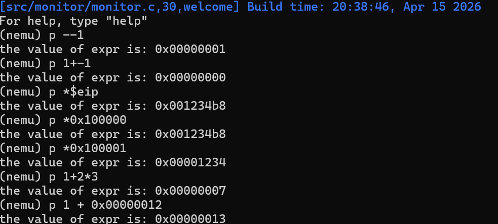
- 内存扫描
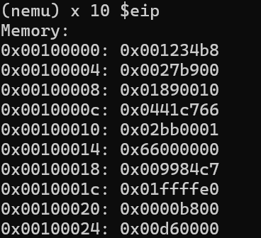
## 阶段三
### 实现监视点池的管理
- 修改nemu/include/monitor/watchpoint.h
```c
#ifndef __WATCHPOINT_H__
#define __WATCHPOINT_H__

#include "common.h"

// 监视点结构体
typedef struct watchpoint {
  int NO;                // 监视点编号
  struct watchpoint *next;// 链表指针

  char expr[128];        // 监视的表达式
  uint32_t old_val;      // 表达式上一次的值
  int hit;               // 触发次数
} WP;

// 监视池初始化
void init_wp_pool(void);
// 新建监视点
WP* new_wp(char *expr_str);
// 释放监视点
void free_wp(int wp_no);
// 显示所有监视点
void display_wp(void);
// 检查监视点值是否变化
bool check_wp(void);

#endif
```
**功能：**
定义监视点的核心数据结构，存储监控所需的全部信息；
**设计思路：**
通过链表指针实现节点串联，配合编号、表达式、旧值、命中计数，完成值变化监控与状态记录。
- 修改 nemu/src/monitor/debug/watchpoint.c
1. 全局变量定义
```c
#define NR_WP 32
static WP wp_pool[NR_WP];  // 静态数组，监视点内存池
static WP *head = NULL;    // 已使用监视点链表头
static WP *free_ = NULL;   // 空闲监视点链表头
```
**核心设计：池式结构 + 双链表**
用固定大小静态数组作为内存池，避免动态内存分配（malloc/free），更稳定高效；
拆分为空闲链表和已使用链表：空闲链表存储未分配的监视点，已使用链表存储正在工作的监视点；
节点仅在两个链表间迁移，无内存申请 / 释放，效率极高。
2. `init_wp_pool` 监视池初始化函数
```c
void init_wp_pool() {
  int i;
  for (i = 0; i < NR_WP; i ++) {
    wp_pool[i].NO = i;
    wp_pool[i].next = &wp_pool[i + 1];
    memset(wp_pool[i].expr, 0, sizeof(wp_pool[i].expr));
    wp_pool[i].old_val = 0;
    wp_pool[i].hit = 0;
  }
  wp_pool[NR_WP - 1].next = NULL;

  head = NULL;
  free_ = wp_pool;
}
```
**功能：**
对监视点静态内存池、链表结构、全局编号计数器进行统一初始化，是模块的入口初始化函数。构建初始空闲链表，重置所有监视点成员变量，保证模块上电初始状态合法。
**核心思路：**
- **链表构建：**遍历静态数组，将所有监视点节点串联为空闲单向链表，尾节点next置空，防止遍历越界；
- **成员初始化：**清空表达式字符串缓冲区，初始化旧值、命中次数为默认值；
- **指针初始化：**free_指向空闲链表头，head置空（无激活监视点）；
- **编号初始化：**显式初始化全局编号计数器wp_id=0（规范工程实践，弥补全局变量隐式初始化的缺陷）。
2.` new_wp `创建监视点函数
```c
WP* new_wp(char *expr_str) {
  if (free_ == NULL) { printf("No free watchpoint!\n"); return NULL; }
  WP *p = free_;
  free_ = free_->next;
  p->NO = wp_id++;
  strncpy(p->expr, expr_str, sizeof(p->expr)-1);
  bool success;
  p->old_val = expr(p->expr, &success);
  p->hit = 0;

  p->next = head;
  head = p;
  return p;
}
```
**功能：**
从空闲链表申请一个监视点节点，绑定用户输入的表达式，计算表达式初始值，将节点加入激活链表，并分配全局唯一编号。
**核心设计：**
- **资源分配：**从空闲链表头部取节点，时间复杂度 O (1)，资源分配高效；
- **唯一标识：**使用自增计数器分配编号，删除后不复用，符合调试工具使用习惯；
- **安全拷贝：**使用strncpy限制表达式长度，避免缓冲区溢出；
- **基准值计算：**调用表达式求值模块计算初始值，作为后续对比基准；
- **链表插入：**头插法加入激活链表，提升节点插入效率。
3.` free_wp ` 删除监视点函数
```c
void free_wp(int wp_no) {
  WP **pp = &head;
  while (*pp) {
    if ((*pp)->NO == wp_no) {
      WP *p = *pp;
      *pp = p->next;
      p->next = free_;
      free_ = p;
      printf("Delete watchpoint %d\n", wp_no);
      return;
    }
    pp = &(*pp)->next;
  }
  printf("Watchpoint %d not found\n", wp_no);
}
```
**功能：**
根据监视点编号，从激活链表中摘除目标节点，重置节点状态并回收至空闲链表，实现监视点资源复用。
**核心设计：**
- **二级指针遍历：**通过二级指针遍历：无需区分头节点 / 普通节点，简化链表删除逻辑，避免空指针异常；
- **节点摘除：**修改前驱节点指针，将目标节点从激活链表移除；
- **资源回收：**将节点插入空闲链表头部，完成资源复用；
- **异常处理：**未找到目标节点时输出提示，提升模块健壮性
### 问题：static的使用
static 定义全局静态变量，该变量只能在本文件中进行访问，保护了数据的安全性。其他源文件想
对该变量进行操作时，需要通过封装的函数来实现，避免直接访问全局变量导致的程序错误。
### 实现监视点
- 修改 nemu/src/monitor/debug/watchpoint.c
1. `display_wp` 显示监视点函数
```c
void display_wp(void) {
  if (head == NULL) { printf("No watchpoints.\n"); return; }
  printf("NO\tEXPR\t\tHIT\n");
  WP *p = head;
  while (p) {
    printf("%d\t%s\t%d\n", p->NO, p->expr, p->hit);
    p = p->next;
  }
}
```
**功能：**
遍历激活链表，格式化输出所有监视点的编号、表达式、命中次数，为用户提供可视化调试界面。
**核心设计：**
- **空值判断**：无激活监视点时直接返回，避免无效遍历；
- **线性遍历**：顺序遍历激活链表，只读访问节点数据；
- **格式化输出**：表格化打印信息，提升交互可读性；
- **无锁设计**：仅读取数据，不修改链表结构，保证执行安全。
2. `check_wp` 监视点检测函数
```c
bool check_wp(void) {
  WP *p = head;
  bool hit = false;
  while (p) {
    bool success;
    uint32_t new_val = expr(p->expr, &success);
    if (success && new_val != p->old_val) {
      hit = true;
      p->hit ++;
      printf("\nWatchpoint %d hit!\n", p->NO);
      printf("Expr: %s\n", p->expr);
      printf("Old: 0x%08x, New: 0x%08x\n", p->old_val, new_val);
      p->old_val = new_val;
    }
    p = p->next;
  }
  return !hit;
}
```
**功能：**
模拟器每条指令执行完成后调用，实时计算所有监视点表达式的当前值，对比新旧值判断是否触发监视点；触发时更新状态并暂停模拟器。
**核心设计：**
- **实时求值**：
- 调用表达式求值**调用表达式模块获取最新值，保证监控精度；
- **值对比逻辑**：仅当计算成功且值发生变化时触发监视点；
- **状态更新**：触发后自增命中次数，打印新旧值并更新基准值；
- **执行控制**：返回值控制模拟器流程 —— 触发返回false(暂停)，未触发返回true(继续)；
- **容错机制**：表达式非法时自动跳过，不影响模拟器运行。

---

- 修改 nemu/src/monitor/debug/ui.c
1. 监视点申请和删除
```c
static int cmd_w(char *args) {
  if (!args) {
    printf("Usage: w <expression>\n");
    return 0;
  }
  new_wp(args);
  return 0;
}
static int cmd_d(char *args) {
  if (!args) {
    printf("Usage: d <watchpoint_number>\n");
    return 0;
  }
  int num = atoi(args);
  free_wp(num);
  return 0;
}
```
2. 监视点信息查看（在cmd_info中补充）
```c
if(s == 'w'){
     display_wp();
     return 0;
   }
```
- 修改 nemu/src/monitor/cpu-exec.c
1. 添加头文件
```c
#include "monitor/watchpoint.h"
```
2. 添加cpu_exec()函数
```c
#ifdef DEBUG
   if(check_wp() == false){
      nemu_state = NEMU_STOP;
   }
#endif
```
### 测试
步骤：
1. 输入`p 1+2`测试表达式求值
2. 输入`w $eax`申请监视点
3. 输入`info w`查看监视点信息
4. 输入`si`单步执行
5. 输入`d 0`删除监视点
6. 输入`info w`查看监视点信息
7. 输入`q`退出模拟器
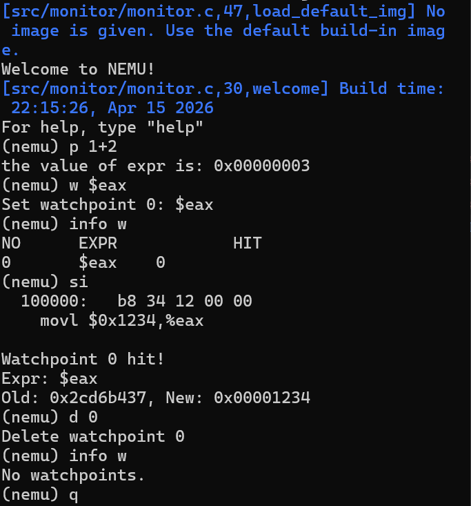
## 必答题
1. 查i386手册
- EFLAGS寄存器的CF位是什么意思
```
2-8 EFLAGS Register
4-1 Systems Flags of EFLAGS Registe
```
- ModR/M字节是什么
```
17.2 INSTRUCTION FORMAT 
17.2.1 ModR/M and SIB Bytes
```
- mov指令的格式是什么
```
17.2 INSTRUCTION FORMAT
    17.2.2.11 Instruction Set Detail 
        MOV ── Move Data. 
        MOV ── Move to/from Special Registers
```
2. shell命令
- 统计 nemu / 目录下所有.c 和.h 文件总行数
```bash
find nemu -name "*.c" -o -name "*.h" | xargs wc -l
```
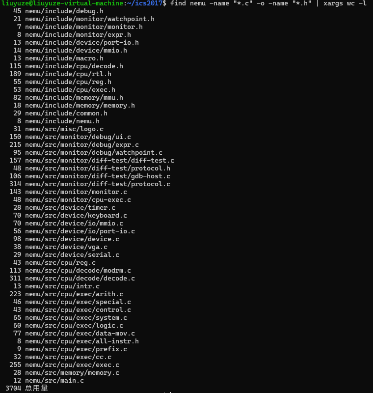
- 统计 PA1 编写的代码行数
```bash
# 1. 切回框架代码分支，统计原始行数
git checkout master
find nemu -name "*.c" -o -name "*.h" | xargs wc -l

# 2. 切回pa1分支，统计当前行数
git checkout pa1
find nemu -name "*.c" -o -name "*.h" | xargs wc -l
```
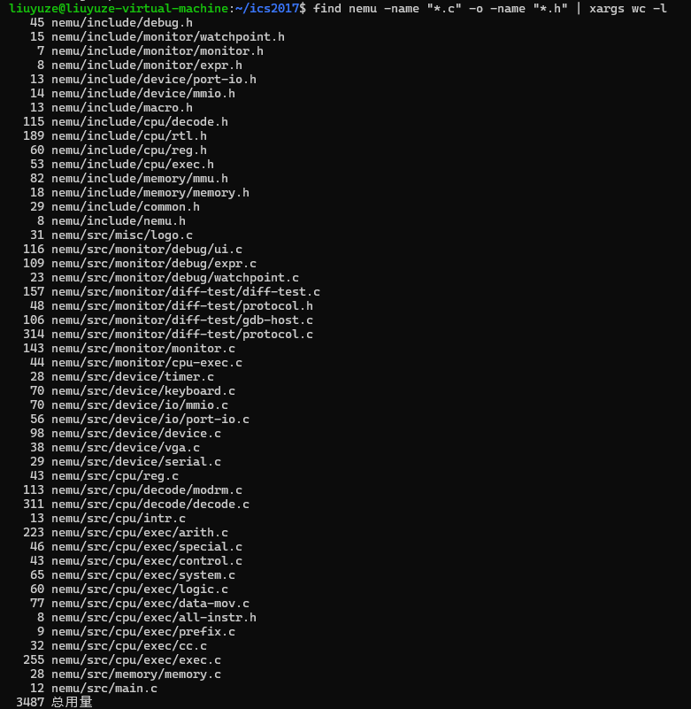
pa1 编写的代码行数 = 3704 - 3487 = 217
- 统计去除空行后的总行数
```bash
find nemu -name "*.c" -o -name "*.h" | xargs grep -v "^$" | wc -l
```
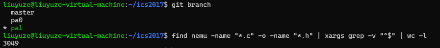
3. GCC 编译

**Wall:**

- 作用：开启 GCC所有常用编译警告，检测代码中潜在问题（如未使用变量、类型不匹配、函数未声明、忽略返回值等）。
- 特点：仅提示警告，不阻止编译。
<br>

**Werror:**

- 作用：将所有编译警告升级为编译错误，只要存在警告就无法生成可执行文件。
<br>

**为什么使用这两个选项：**


- **Wall：** 开启所有常用编译警告，帮助发现代码中的潜在问题。
- **-Werror：** 将警告升级为错误，强制修复问题，确保代码质量。
