# 计算机系统基础 PA2
**姓名：**  刘宇泽  
**学号：**  2411334
## 阶段一
### 1. 计算机工作方式
在pa1中，已经得到计算机TRM的工作方式。
```c
while(1){
    从EIP知识的存储器位置取出指令；
    执行指令；
    更新EIP；
}
```
### 2. 编译并运行dummy程序，查看错误
在终端执行
```bash
cd ~/ics2017/nexus-am/tests/cputest
make ARCH=x86-nemu ALL=dummy run
```
编译运行dummy程序
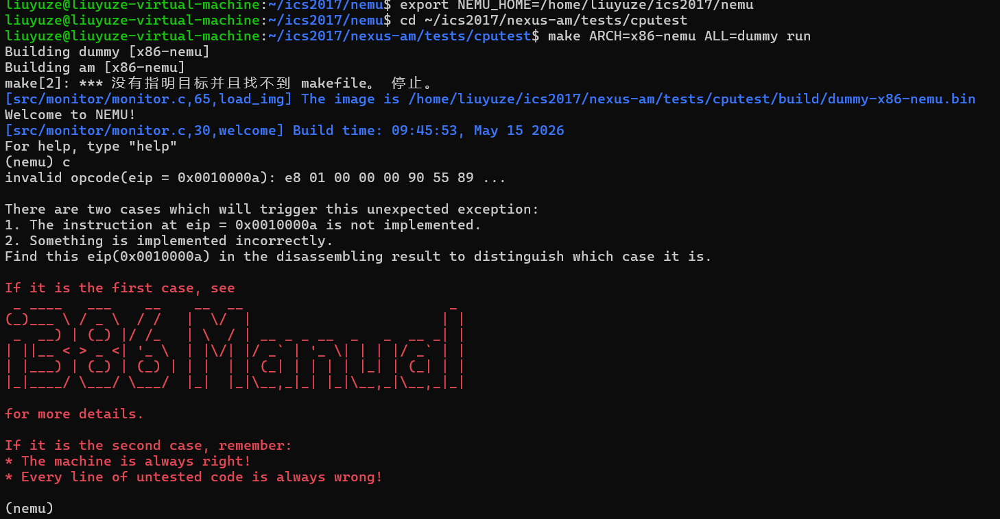
现在我们看到错误信息：
```c
invalid opcode(eip = 0x0010000a): e8 01 00 00 00 90 55 89 ...
```
### 3. 查看反汇编文件获取详细信息
输入如下指令查看dummy的反汇编：
```bash
cat ~/ics2017/nexus-am/tests/cputest/build/dummy-x86-nemu.txt
```
得到反汇编代码
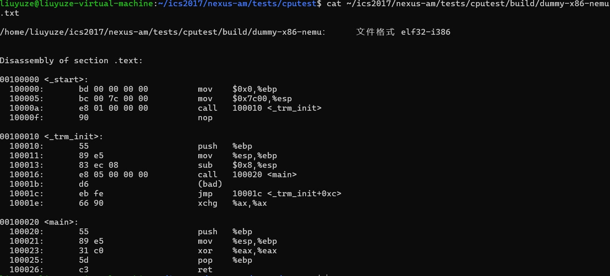
### 4. 查询手册
查询i386手册的opcode表，找到opcode table，寻找操作码e8对应指令，得到：

然后在手册中寻找A和v的含义：
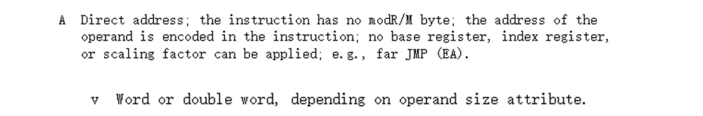
用相同方式找到需要实现的六个指令的手册页，总结得到：


| 指令 | 操作码 | 描述 |
|------|--------|------|
| call | e8 | Call near, displacement relativeto next instruction |
| call | e8 | Call near, displacement relativeto next instruction |
| push | 50+rw/rb | Push register word/dword |
| push | 50+rw/rb | Push register word/dword |
| sub | 83 | Subtract sign-extended immediate byte from from r/m word |
| xor | 31 | Exclusive-OR dword register to r/m word/dword |
| xor | 31 | Exclusive-OR dword register to r/m word/dword |
| pop | 58+rw/rb | Pop top of stack into word/dword register |
| ret | c3 | Return (near) to caller |
| ret | c3 | Return (near) to caller |
### 5. 指令实现
#### 5.1 call指令实现
##### 5.1.1 修改 all-instr.h 增加 call 指令声明
```c
make_EHelper(call);
```
##### 5.1.2 修改 exec.c 的 opcode_table
```c
 /* 0xe8 */ IDEX(J, call), EMPTY, EMPTY, EMPTY,
```
##### 5.1.3 修改 control.c 的 make_EHelper(call)
```c
make_EHelper(call) {
  // the target address is calculated at the decode stage
  rtl_li(&t2, decoding.seq_eip);
  rtl_push(&t2);
  decoding.is_jmp = 1;

  print_asm("call %x", decoding.jmp_eip);
}
```
*分析：*先把返回地址存到临时寄存器t2，然后用t2的值压栈，最后设置跳转标志。

#### 5.2 push&pop指令实现
##### 5.2.1 修改 all-instr.h 增加 push 指令声明
```c
make_EHelper(push);
make_EHelper(pop);
```
##### 5.2.2 修改 exec.c 的 opcode_table
```c
/* 0x50 */	IDEX(r,push), IDEX(r,push), IDEX(r,push), IDEX(r,push),
/* 0x54 */	IDEX(r,push), IDEX(r,push), IDEX(r,push), IDEX(r,push),
/* 0x58 */	IDEX(r,pop), IDEX(r,pop), IDEX(r,pop), IDEX(r,pop),
/* 0x5c */	IDEX(r,pop), IDEX(r,pop), IDEX(r,pop), IDEX(r,pop),
```
##### 5.2.3 修改 rtl.h 增加 push&pop 指令的实现
```c
static inline void rtl_push(const rtlreg_t* src1) {
  // esp <- esp - 4
  rtl_subi(&cpu.esp, &cpu.esp, 4);
  // M[esp] <- src1
  rtl_sm(&cpu.esp, 4, src1);
}
static inline void rtl_pop(rtlreg_t* dest) {
  // dest <- M[esp]
  rtl_lm(dest, &cpu.esp, 4);
  // esp <- esp + 4
  rtl_addi(&cpu.esp, &cpu.esp, 4);
}
```
##### 5.2.4 在 data-mov.c 完成执行函数
```c
make_EHelper(push) {
  rtl_push(&id_dest->val);
  print_asm_template1(push);
}

make_EHelper(pop) {
  rtl_pop(&id_dest->val);
  operand_write(id_dest, &id_src->val);
  print_asm_template1(pop);
}
```
#### 5.3 ret指令实现
##### 5.3.1 查看i386手册
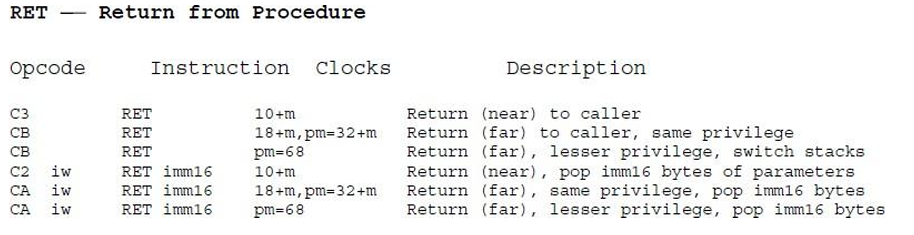
##### 5.3.2 修改 all-instr.h 增加 ret 指令声明
```c
make_EHelper(ret);
```
##### 5.3.3 修改 exec.c 的 opcode_table
```c
  /* 0xc0 */	IDEXW(gp2_Ib2E, gp2, 1), IDEX(gp2_Ib2E, gp2), EMPTY, EX(ret),
```
##### 5.3.4 修改 control.c 实现 ret 指令
```c
make_EHelper(ret) {
  rtl_pop(&decoding.jmp_eip);
  decoding.is_jmp = 1;

  print_asm("ret");
}
```
#### 5.4 EFLAGS寄存器实现
##### 5.4.1 在 reg.h 中增加 EFLAGS 寄存器
```c
  struct {
    unsigned int CF:1;
    unsigned int one:1;
    unsigned int :4;
    unsigned int ZF:1;
    unsigned int SF:1;
    unsigned int :1;
    unsigned int IF:1;
    unsigned int :1;
    unsigned int OF:1;
    unsigned int :1;
  } eflags;
```
##### 5.4.2 在 monitor.c 中初始化EFLAGS寄存器
根据i386手册，EFLAGS初始值为 0x00000002
```c
static inline void restart() {
  /* Set the initial instruction pointer. */
  cpu.eip = ENTRY_START;
  unsigned int origin = 2;
  memcpy(&cpu.eflags, &origin, sizeof(cpu.eflags));
#ifdef DIFF_TEST
  init_qemu_reg();
#endif
}
```
##### 5.4.3 修改 rtl.h
##### 标志位读写函数
```c
#define make_rtl_setget_eflags(f) \
  static inline void concat(rtl_set_, f) (const rtlreg_t* src) { \
    cpu.eflags.f = *src; \
  } \
  static inline void concat(rtl_get_, f) (rtlreg_t* dest) { \
    *dest = cpu.eflags.f; \
  }
```
##### 标志位更新函数
```c
static inline void rtl_eq0(rtlreg_t* dest, const rtlreg_t* src1) {
  // dest <- (src1 == 0 ? 1 : 0)
  rtl_sltui(dest, src1, 1);
}

static inline void rtl_eqi(rtlreg_t* dest, const rtlreg_t* src1, int imm) {
  // dest <- (src1 == imm ? 1 : 0)
  rtl_xori(dest, src1, imm);
  rtl_eq0(dest, dest);
}

static inline void rtl_neq0(rtlreg_t* dest, const rtlreg_t* src1) {
  // dest <- (src1 != 0 ? 1 : 0)
  rtl_eq0(dest, src1);
  rtl_eq0(dest, dest);
}

static inline void rtl_msb(rtlreg_t* dest, const rtlreg_t* src1, int width) {
  // dest <- src1[width * 8 - 1]
  *dest = ((*src1) >> (width*8-1)) & 0x1;
}

static inline void rtl_update_ZF(const rtlreg_t* result, int width) {
  // eflags.ZF <- is_zero(result[width * 8 - 1 .. 0])
  int zf = 0;
  if(width == 1) {
    zf = (*result & 0x000000ff) | 0;
  }
  if(width == 2) {
    zf = (*result & 0x0000ffff) | 0;
  }
  if(width == 4) {
    zf = (*result & 0xffffffff) | 0;
  }
  cpu.eflags.ZF = (zf == 0) ? 1 : 0;
}

static inline void rtl_update_SF(const rtlreg_t* result, int width) {
  // eflags.SF <- is_sign(result[width * 8 - 1 .. 0])
  int sf = 0;
  sf = (*result >> (width*8-1)) & 0x1;
  cpu.eflags.SF = sf;
}
```
##### 5.4.4 修改 decode.c ，实现Dophelper，调用取指进行取字
```c
static inline make_DopHelper(SI) {
  assert(op->width == 1 || op->width == 4);

  op->type = OP_TYPE_IMM;

  /* TODO: Use instr_fetch() to read `op->width' bytes of memory
   * pointed by `eip'. Interpret the result as a signed immediate,
   * and assign it to op->simm.
   *
   * op->simm = ???
   */
  op->simm = instr_fetch(eip, op->width);
  if(op->width == 1)
    op->simm = (int8_t)op->simm;
  rtl_li(&op->val, op->simm);

#ifdef DEBUG
  snprintf(op->str, OP_STR_SIZE, "$0x%x", op->simm);
#endif
}
```
#### 5.5 sub指令实现
##### 5.5.1 查看i386手册
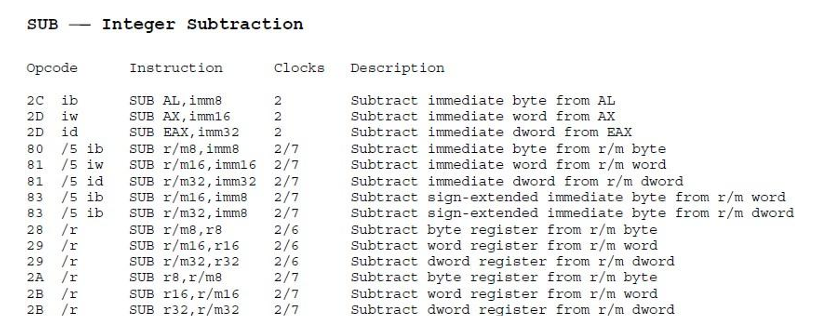
##### 5.5.2 修改 all-instr.h 增加 sub 指令声明
```c
make_EHelper(sub);
```
##### 5.5.3 修改 exec.c 的 opcode_table
##### 填写optable
```c
  /* 0x28 */	IDEX(G2E, sub), IDEX(E2G, sub), IDEX(G2E, sub), IDEX(E2G, sub),
  /* 0x2c */	IDEX(I2a, sub), IDEX(I2a, sub), EMPTY, EMPTY,
```  
##### 填写执行函数
因为 sub 的 ext_opcode=5，所以在 opcode_table_gp1[5]处填写 EX(sub) 执行函数。
```c
make_group(gp1,
  EMPTY, EMPTY, EMPTY, EMPTY,
  EMPTY, EX(sub), EX(xor), EMPTY)
```
##### 5.5.4 修改 arith.c 实现 sub 指令
```c
make_EHelper(sub) {
  rtl_sub(&t2, &id_dest->val, &id_src->val);
  operand_write(id_dest, &t2);
  rtl_update_ZFSF(&t2, id_dest->width);
  rtl_sltu(&t0, &id_dest->val, &t2);
  rtl_set_CF(&t0);
  rtl_xor(&t0, &id_dest->val, &id_src->val);
  rtl_xor(&t1, &id_dest->val, &t2);
  rtl_and(&t0, &t0, &t1);
  rtl_msb(&t0, &t0, id_dest->width);
  rtl_set_OF(&t0);
  print_asm_template2(sub);
}
```
#### 5.6 xor指令实现
##### 5.6.1 查看i386手册
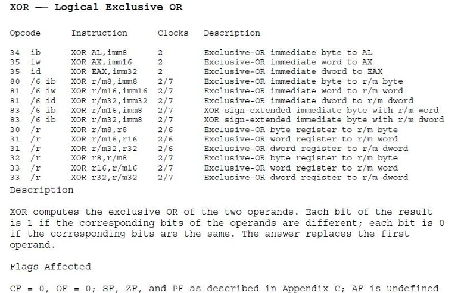
##### 5.6.2 修改 all-instr.h 增加 xor 指令声明
```c
make_EHelper(xor);
```
##### 5.6.3 修改 exec.c 的 opcode_table
```c
  /* 0x30 */	IDEXW(G2E, xor, 1), IDEX(G2E, xor), IDEXW(E2G, xor, 1), IDEX(E2G, xor),
  /* 0x34 */	EMPTY, IDEX(I2a, xor), EMPTY, EMPTY,
```
##### 5.6.4 修改 logic.c 实现 xor 指令
```c
make_EHelper(xor) {
  rtl_xor(&id_dest->val, &id_dest->val, &id_src->val);
  operand_write(id_dest, &id_dest->val);
  
  rtl_li(&t0, 0);
  rtl_set_CF(&t0);
  rtl_set_OF(&t0);
  
  rtl_update_ZFSF(&id_dest->val, id_dest->width);
  
  print_asm_template2(xor);
}
```
### 6. 实验结果
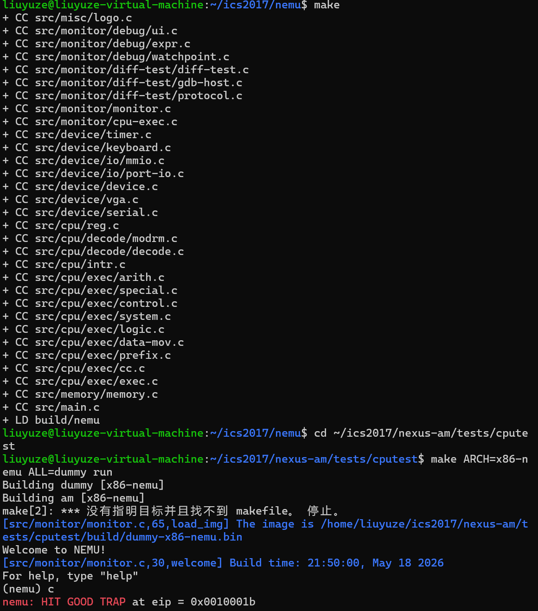

---

## 阶段二
### 1. 运行dummy程序
在终端输入以下指令：
```bash
cd ~/ics2017/nexus-am/tests/cputest
make ARCH=x86-nemu ALL=add run
```
得到：
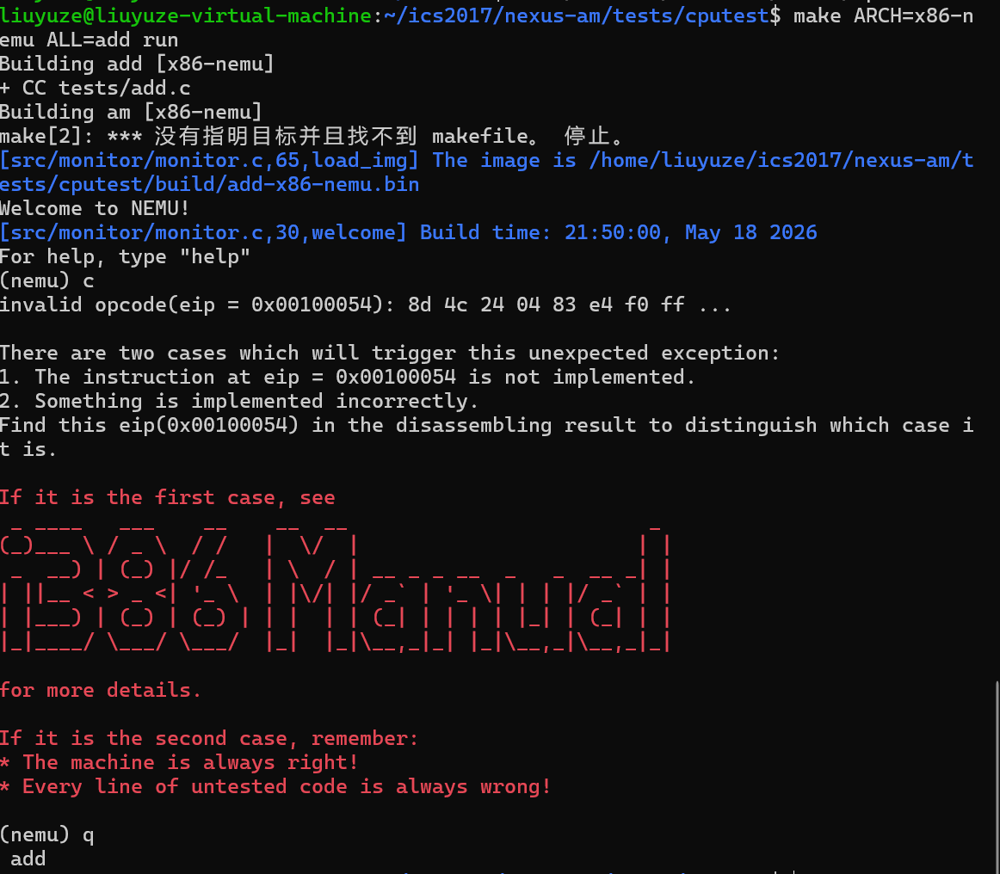
### 2. 打开 add-x86-nemu.txt 查看反汇编代码
```asm
00100054 <main>:
  100054:       8d 4c 24 04             lea    0x4(%esp),%ecx
  100058:       83 e4 f0                and    $0xfffffff0,%esp
  10005b:       ff 71 fc                pushl  -0x4(%ecx)
  10005e:       55                      push   %ebp
  10005f:       89 e5                   mov    %esp,%ebp
  100061:       57                      push   %edi
  100062:       56                      push   %esi
  100063:       53                      push   %ebx
  100064:       51                      push   %ecx
  100065:       83 ec 08                sub    $0x8,%esp
  100068:       31 ff                   xor    %edi,%edi
  10006a:       66 90                   xchg   %ax,%ax
  10006c:       8d 34 3f                lea    (%edi,%edi,1),%esi
  10006f:       31 db                   xor    %ebx,%ebx
  100071:       8d 76 00                lea    0x0(%esi),%esi
  100074:       83 ec 0c                sub    $0xc,%esp
  100077:       8b 87 e0 01 10 00       mov    0x1001e0(%edi),%eax
  10007d:       03 83 e0 01 10 00       add    0x1001e0(%ebx),%eax
  100083:       3b 84 b3 e0 00 10 00    cmp    0x1000e0(%ebx,%esi,4),%eax
  10008a:       0f 94 c0                sete   %al
  10008d:       0f b6 c0                movzbl %al,%eax
  100090:       50                      push   %eax
  100091:       e8 96 ff ff ff          call   10002c <nemu_assert>
  100096:       83 c3 04                add    $0x4,%ebx
  100099:       83 c4 10                add    $0x10,%esp
  10009c:       83 fb 20                cmp    $0x20,%ebx
  10009f:       75 d3                   jne    100074 <main+0x20>
  1000a1:       83 ec 0c                sub    $0xc,%esp
  1000a4:       6a 01                   push   $0x1
  1000a6:       e8 81 ff ff ff          call   10002c <nemu_assert>
  1000ab:       83 c7 04                add    $0x4,%edi
  1000ae:       83 c4 10                add    $0x10,%esp
  1000b1:       83 ff 20                cmp    $0x20,%edi
  1000b4:       75 b6                   jne    10006c <main+0x18>
  1000b6:       83 ec 0c                sub    $0xc,%esp
  1000b9:       6a 01                   push   $0x1
  1000bb:       e8 6c ff ff ff          call   10002c <nemu_assert>
  1000c0:       31 c0                   xor    %eax,%eax
  1000c2:       8d 65 f0                lea    -0x10(%ebp),%esp
  1000c5:       59                      pop    %ecx
  1000c6:       5b                      pop    %ebx
  1000c7:       5e                      pop    %esi
  1000c8:       5f                      pop    %edi
  1000c9:       5d                      pop    %ebp
  1000ca:       8d 61 fc                lea    -0x4(%ecx),%esp
  1000cd:       c3                      ret
```
- 实现 lea 指令，随后再次编译运行 add.c，可查看下一 invalid opcode 所在位置（0x100058），完善该指令（and），重复上述步骤，至 add.c 成功运行。
### 3. 修改 all-instr.h 添加完整声明
```c
make_EHelper(lea);
make_EHelper(and);
make_EHelper(xchg);
make_EHelper(nop);
make_EHelper(setcc);
make_EHelper(jcc);
make_EHelper(gp2);
make_EHelper(test);
make_EHelper(add);
make_EHelper(cmp);
make_EHelper(jmp);
make_EHelper(jmp_rm);
make_EHelper(mul);
make_EHelper(imul1);
make_EHelper(imul2);
make_EHelper(imul3);
make_EHelper(div);
make_EHelper(idiv);
make_EHelper(adc);
make_EHelper(sbb);
make_EHelper(neg);
make_EHelper(or);
make_EHelper(not);
make_EHelper(dec);
make_EHelper(inc);
make_EHelper(cltd);
make_EHelper(leave);
make_EHelper(call_rm);
```
### 4. 指令实现
#### 4.1 lea指令实现
>根据反汇编代码，其opcode=8c。
```asm
  100054:       8d 4c 24 04             lea    0x4(%esp),%ecx
```
##### 4.1.1 修改exec.c

```c
  /* 0x8c */	EMPTY, IDEX(G2E, lea), EMPTY, EMPTY,
```
#### 4.2 and指令实现
>根据反汇编代码，opcode是0x83，属于扩展opcode组（gp1）
```asm
 100058:       83 e4 f0                and    $0xfffffff0,%esp
```
##### 4.2.1 修改exec.c

###### optable修改
```c
  /* 0x20 */	IDEXW(G2E, and, 1), IDEX(G2E, and), IDEXW(E2G, and, 1), IDEX(E2G, and),
  /* 0x24 */	IDEXW(I2a, and, 1), IDEX(I2a, and), EMPTY, EMPTY,
```
###### 填写执行函数
```c
/* 0x80, 0x81, 0x83 */
make_group(gp1,
  EMPTY, EMPTY, EMPTY, EMPTY,
  EX(and), EX(sub), EX(xor), EMPTY)
```
##### 4.2.2 修改 logic.c
```c
make_EHelper(and) {
  rtl_and(&t0, &t1, &t2);
}
```
#### 4.3 xchg（NOP） 指令实现
>查看反汇编代码,`chg %ax,%ax` 实际上什么都没做，可以用 `nop` 作为执行函数。
```asm
10006a:       66 90                   xchg   %ax,%ax
```
>查看i386
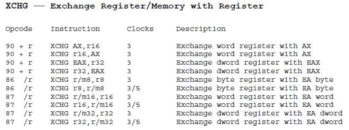
##### 4.3.1 修改opcode_table

```c
  /* 0x90 */	EX(nop), EMPTY, EMPTY, EMPTY,
```
#### 4.4 add 指令实现
>根据反汇编代码，opcode是0x03
```asm
10007d:       03 83 e0 01 10 00       add    0x1001e0(%ebx),%eax
```
##### 4.4.1 修改exec.c
###### optable修改
```c
  /* 0x00 */	IDEXW(G2E, add, 1), IDEX(G2E, add), IDEXW(E2G, add, 1), IDEX(E2G, add),
  /* 0x04 */	IDEXW(I2a, add, 1), IDEX(I2a, add), EMPTY, EMPTY,
```
###### 填写执行函数
```c
make_group(gp1,
  EX(add), EMPTY, EMPTY, EMPTY,
  EX(and), EX(sub), EX(xor), EMPTY)
```
##### 4.4.2 修改 arith.c
```c
make_EHelper(add) {
  rtl_add(&t2, &id_dest->val, &id_src->val);
  operand_write(id_dest, &t2);
  
  rtl_update_ZFSF(&t2, id_dest->width);
  
  rtl_sltu(&t0, &t2, &id_dest->val);
  rtl_set_CF(&t0);
  
  rtl_xor(&t0, &id_dest->val, &id_src->val);
  rtl_xor(&t1, &id_dest->val, &t2);
  rtl_and(&t0, &t0, &t1);
  rtl_msb(&t0, &t0, id_dest->width);
  rtl_set_OF(&t0);
  
  print_asm_template2(add);
}
```
#### 4.5 cmp 指令实现
>根据反汇编代码，opcode是0x3b。cmp和sub类似，只是不存储结果，只更新EFLAGS。
```asm
100083:       3b 84 b3 e0 00 10 00    cmp    0x1000e0(%ebx,%esi,4),%eax
```
##### 4.5.1 修改exec.c
###### optable修改
```c
  /* 0x38 */	IDEXW(G2E, cmp, 1), IDEX(G2E, cmp), IDEXW(E2G, cmp, 1), IDEX(E2G, cmp),
  /* 0x3c */	IDEXW(I2a, cmp, 1), IDEX(I2a, cmp), EMPTY, EMPTY,
```
###### 填写执行函数
```c
make_group(gp1,
  EX(add), EMPTY, EMPTY, EMPTY,
  EX(and), EX(sub), EX(xor), EX(cmp))
```
##### 4.5.2 修改 arith.c
```c
make_EHelper(cmp) {
  rtl_sub(&t2, &id_dest->val, &id_src->val);
  
  rtl_update_ZFSF(&t2, id_dest->width);
  
  rtl_sltu(&t0, &id_dest->val, &t2);
  rtl_set_CF(&t0);
  
  rtl_xor(&t0, &id_dest->val, &id_src->val);
  rtl_xor(&t1, &id_dest->val, &t2);
  rtl_and(&t0, &t0, &t1);
  rtl_msb(&t0, &t0, id_dest->width);
  rtl_set_OF(&t0);
  
  print_asm_template2(cmp);
}
```
#### 4.6 SETcc 指令实现
>查看反汇编，这是两字节opcode（0x0f 0x94），需要实现 sete（set if equal）。
```asm
10008a:       0f 94 c0                sete   %al
```
>查看i386
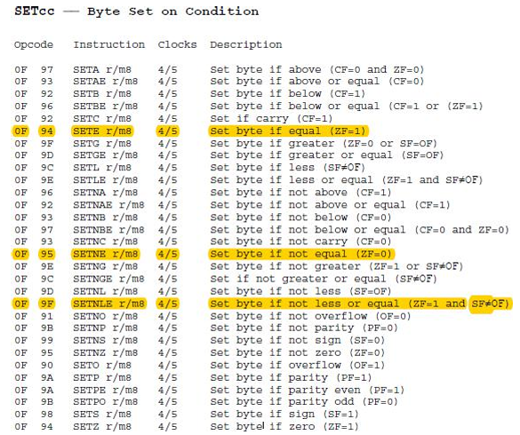
##### 4.6.1 修改exec.c
###### optable修改
```c
  /* 0x94 */	IDEXW(E, setcc, 1), IDEXW(E, setcc, 1), EMPTY, EMPTY,
  /* 0x98 */	EMPTY, EMPTY, EMPTY, EMPTY,
  /* 0x9c */	EMPTY, EMPTY, EMPTY, IDEXW(E, setcc, 1),
```
###### 填写执行函数
```c
/* 0xf6, 0xf7 */
make_group(gp3,
  IDEX(test_I, test), EMPTY, EMPTY, EMPTY,
  EMPTY, EX(imul1), EMPTY, EMPTY)
```
##### 4.6.2 修改 cc.c
```c
void rtl_setcc(rtlreg_t* dest, uint8_t subcode) {
  bool invert = subcode & 0x1;
  enum {
    CC_O, CC_NO, CC_B,  CC_NB,
    CC_E, CC_NE, CC_BE, CC_NBE,
    CC_S, CC_NS, CC_P,  CC_NP,
    CC_L, CC_NL, CC_LE, CC_NLE
  };

  // dest <- ( cc is satisfied ? 1 : 0)
  switch (subcode & 0xe) {
    case CC_O:
      rtl_get_OF(dest);
      break;
    case CC_B:
      rtl_get_CF(dest);
      break;
    case CC_E:
      rtl_get_ZF(dest);
      break;
    case CC_BE:
      rtl_get_CF(&t0);
      rtl_get_ZF(&t1);
      rtl_or(dest, &t0, &t1);
      break;
    case CC_S:
      rtl_get_SF(dest);
      break;
    case CC_L:
      rtl_get_SF(&t0);
      rtl_get_OF(&t1);
      rtl_xor(dest, &t0, &t1);
      break;
    case CC_LE:
      rtl_get_SF(&t0);
      rtl_get_OF(&t1);
      rtl_xor(&t2, &t0, &t1);
      rtl_get_ZF(&t0);
      rtl_or(dest, &t2, &t0);
      break;
    default: panic("should not reach here");
    case CC_P: panic("n86 does not have PF");
  }

  if (invert) {
    rtl_xori(dest, dest, 0x1);
  }
}
```
#### 4.7 jcc 指令实现
>根据反汇编代码，opcode是0x75
```asm
10009f:       75 d3                   jne    100074 <main+0x20>
```
##### 4.7.1 修改exec.c
- 1字节 opcode：
```c
  /* 0x70 */	EMPTY, EMPTY, IDEXW(J, jcc, 1), IDEXW(J, jcc, 1),
  /* 0x74 */	IDEXW(J, jcc, 1), IDEXW(J, jcc, 1), IDEXW(J, jcc, 1), IDEXW(J, jcc, 1),
  /* 0x78 */	IDEXW(J, jcc, 1), IDEXW(J, jcc, 1), IDEXW(J, jcc, 1), IDEXW(J, jcc, 1),
  /* 0x7c */	IDEXW(J, jcc, 1), IDEXW(J, jcc, 1), IDEXW(J, jcc, 1), IDEXW(J, jcc, 1),
```
- 2字节 offset：
```c
  /* 0x80 */	IDEX(J, jcc), IDEX(J, jcc), IDEX(J, jcc), IDEX(J, jcc),
  /* 0x84 */	IDEX(J, jcc), IDEX(J, jcc), IDEX(J, jcc), IDEX(J, jcc),
  /* 0x88 */	IDEX(J, jcc), IDEX(J, jcc), EMPTY, EMPTY,
  /* 0x8c */	IDEX(J, jcc), IDEX(J, jcc), IDEX(J, jcc), IDEX(J, jcc),
```
#### 4.8 movzx&movsx 指令实现
>根据反汇编代码，opcode是0x0f 0xb6
```asm
1000a4:       0f b6 00                movzx  %al, %ax
```
##### 4.8.1 修改exec.c
```c
  /* 0xb4 */	EMPTY, EMPTY, IDEXW(E2G, movzx, 1), IDEXW(E2G, movzx, 2),
  /* 0xb8 */	EMPTY, EMPTY, EMPTY, EMPTY,
  /* 0xbc */	EMPTY, EMPTY, IDEXW(E2G, movsx, 1), IDEXW(E2G, movsx, 2),
```
#### 4.9 SAR/SAL/SHL/SHR 指令实现
>这些是移位指令，属于 gp2 组（opcode 0xc1）。
##### 4.9.1 修改 rtl.h 添加 rtl_mv, rtl_not, rtl_sext
```c
static inline void rtl_mv(rtlreg_t* dest, const rtlreg_t *src1) {
  // dest <- src1
  rtl_add(dest, src1, &tzero);
}

static inline void rtl_not(rtlreg_t* dest) {
  // dest <- ~dest
  rtl_xori(dest, dest, 0xffffffff);
}

static inline void rtl_sext(rtlreg_t* dest, const rtlreg_t* src1, int width) {
  // dest <- signext(src1[(width * 8 - 1) .. 0])
  if(width==4){
    rtl_mv(dest, src1);
  }
  else{
    assert(width==1||width==2);
    rtl_shli(dest, src1, (4-width)*8);
    rtl_sari(dest, src1, (4-width)*8);
  }
}
```
##### 4.9.2 logic.c 实现shl, shr,asr执行函数
```c
make_EHelper(shl) {
  rtl_shl(&t2, &id_dest->val, &id_src->val);
  operand_write(id_dest, &t2);
  // unnecessary to update CF and OF in NEMU
  rtl_update_ZFSF(&t2, id_dest->width);
  print_asm_template2(shl);
}

make_EHelper(shr) {
  rtl_shr(&t2, &id_dest->val, &id_src->val);
  operand_write(id_dest, &t2);
  // unnecessary to update CF and OF in NEMU
  rtl_update_ZFSF(&t2, id_dest->width);
  print_asm_template2(shr);
}

make_EHelper(sar) {
  rtl_sext(&t2, &id_dest->val, id_dest->width);
  rtl_sari(&t2, &t2, id_src->val);
  operand_write(id_dest, &t2);
  rtl_update_ZFSF(&t2, id_dest->width);
  // unnecessary to update CF and OF in NEMU
  print_asm_template2(sar);
}
```
##### 4.9.3 修改 exec.c
```c
/* 0xc0, 0xc1, 0xd0, 0xd1, 0xd2, 0xd3 */
make_group(gp2,
  EMPTY, EMPTY, EMPTY, EMPTY,
  EX(shl), EX(shr), EMPTY, EX(sar))
```
#### 4.10 push&pushl 指令实现
>查看汇编
```asm
10005b:       ff 71 fc                pushl  -0x4(%ecx)
1000a4:       6a 01                   push   $0x1
```
##### 4.10.1 修改exec.c
```c
 /* 0xff */
make_group(gp5,
  EMPTY, EMPTY, EMPTY, EMPTY,
  EMPTY, EMPTY, EX(push), EMPTY)
```
```c
  /* 0x68 */	IDEX(I, push), EMPTY, IDEXW(push_SI, push, 1), IDEX(I_E2G, imul3),
```
#### 4.11 test 指令实现
##### 4.11.1 修改exec.c
```c
  /* 0x84 */	IDEXW(G2E, test, 1), IDEX(G2E, test), IDEXW(E2G, test, 1), IDEX(E2G, test),
  /* 0xa8 */	IDEXW(I2a, test, 1), IDEX(I2a, test), EMPTY, EMPTY,
```
```c
make_group(gp3,
  IDEX(test_I, test), EMPTY, EX(not), EX(neg),
  EX(mul), EX(imul1), EX(div), EX(idiv))
```
##### 4.11.2 修改 logic.c
```c
make_EHelper(test) {
  rtl_and(&t2, &id_dest->val, &id_src->val);
  rtl_update_ZFSF(&t2, id_dest->width);
  rtl_set_CF(&tzero);
  rtl_set_OF(&tzero);
  print_asm_template2(test);
}
```
#### 4.12 jmp 指令实现
##### 4.12.1 修改exec.c
```c
  /* 0xe8 */	IDEX(J, call), IDEX(J, jmp), EMPTY, IDEXW(J, jmp, 1),
```

#### 4.13 mul&imul&div&idiv 指令实现
##### 4.13.1 修改exec.c
```c
  /* 0x68 */	IDEX(I, push), EMPTY, IDEXW(push_SI, push, 1), IDEX(I_E2G, imul3),
  /* 0xac */	IDEX(E2G, imul2), EMPTY, EMPTY, EMPTY,
```
```c
make_group(gp3,
  IDEX(test_I, test), EMPTY, EX(not), EX(neg),
  EX(mul), EX(imul1), EX(div), EX(idiv))
```

#### 4.14 adc&sbb 指令实现
##### 4.14.1 修改exec.c
```c
  /* 0x10 */	IDEXW(G2E, adc, 1), IDEX(G2E, adc), IDEXW(E2G, adc, 1), IDEX(E2G, adc),
  /* 0x14 */	IDEXW(I2a, adc, 1), IDEX(I2a, adc), EMPTY, EMPTY,
  /* 0x18 */	IDEXW(G2E, sbb, 1), IDEX(G2E, sbb), IDEXW(E2G, sbb, 1), IDEX(E2G, sbb),
  /* 0x1c */	IDEXW(I2a, sbb, 1), IDEX(I2a, sbb), EMPTY, EMPTY,
```
```c
make_group(gp1,
  EX(add), EX(or), EX(adc), EX(sbb),
  EX(and), EX(sub), EX(xor), EX(cmp))
```

#### 4.15 neg 指令实现
##### 4.15.1 修改arith.c
```c
make_EHelper(neg) {
  rtl_sub(&t2, &tzero, &id_dest->val);
  operand_write(id_dest, &t2);
  rtl_update_ZFSF(&t2, id_dest->width);
  rtl_neq0(&t0, &id_dest->val);
  rtl_set_CF(&t0);
  rtl_eqi(&t0, &id_dest->val, 0x80000000);
  rtl_set_OF(&t0);
  print_asm_template1(neg);
}
```
##### 4.15.2 修改 exec.c
```c
make_group(gp3,
  IDEX(test_I, test), EMPTY, EX(not), EX(neg),
  EX(mul), EX(imul1), EX(div), EX(idiv))
```
`
#### 4.16 or 指令实现
##### 4.16.1 修改exec.c
```c
  /* 0x08 */	IDEXW(G2E, or, 1), IDEX(G2E, or), IDEXW(E2G, or, 1), IDEX(E2G, or),
  /* 0x0c */	IDEXW(I2a, or, 1), IDEX(I2a, or), EMPTY, EX(2byte_esc),
```
```c
make_group(gp1,
  EX(add), EX(or), EX(adc), EX(sbb),
  EX(and), EX(sub), EX(xor), EX(cmp))
```
##### 4.16.2 修改 logic.c
```c
make_EHelper(or) {
  rtl_or(&t2, &id_dest->val, &id_src->val);
  operand_write(id_dest, &t2);
  rtl_update_ZFSF(&t2, id_dest->width);
  rtl_set_CF(&tzero);
  rtl_set_OF(&tzero);
  
  print_asm_template2(or);
}
```
#### 4.17 not 指令实现
##### 4.17.1 修改exec.c
```c
/* 0xf6, 0xf7 */
make_group(gp3,
  IDEX(test_I, test), EMPTY, EX(not), EX(neg),
  EX(mul), EX(imul1), EX(div), EX(idiv))
```

##### 4.17.2 修改 logic.c
```c
make_EHelper(not) {
  rtl_not(&id_dest->val);
  operand_write(id_dest, &id_dest->val);
  print_asm_template1(not);
}
```
#### 4.18 dec&inc 指令实现
##### 4.18.1 修改exec.c
```c
make_group(gp4,
  EX(inc), EX(dec), EMPTY, EMPTY,
  EMPTY, EMPTY, EMPTY, EMPTY)
make_group(gp5,
  EX(inc), EX(dec), EX(call_rm), EMPTY,
  EX(jmp_rm), EMPTY, EX(push), EMPTY)
```
```c
  /* 0x40 */	IDEX(r, inc), IDEX(r, inc), IDEX(r, inc), IDEX(r, inc),
  /* 0x44 */	IDEX(r, inc), IDEX(r, inc), IDEX(r, inc), IDEX(r, inc),
  /* 0x48 */	IDEX(r, dec), IDEX(r, dec), IDEX(r, dec), IDEX(r, dec),
  /* 0x4c */	EMPTY, EMPTY, IDEX(r, dec), IDEX(r, dec),
```
##### 4.18.2 修改 arith.c
```c
make_EHelper(inc) {
  rtl_addi(&t2, &id_dest->val, 1);
  operand_write(id_dest, &t2);
  rtl_update_ZFSF(&t2, id_dest->width);
  rtl_eqi(&t0, &id_dest->val, 0x7fffffff);
  rtl_set_OF(&t0);
  print_asm_template1(inc);
}

make_EHelper(dec) {
  rtl_subi(&t2, &id_dest->val, 1);
  operand_write(id_dest, &t2);
  rtl_update_ZFSF(&t2, id_dest->width);
  rtl_eqi(&t0, &id_dest->val, 0x80000000);
  rtl_set_OF(&t0);
  print_asm_template1(dec);
}
```
#### 4.19 cltd&leave 指令实现
##### 4.19.1 修改exec.c
```c
  /* 0x98 */	EX(cltd), EMPTY, EMPTY, EX(leave),
```
###### 4.19.2 修改 data-mov.c
```c
make_EHelper(leave) {
  rtl_mv(&cpu.esp, &cpu.ebp);
  rtl_pop(&cpu.ebp);
  print_asm("leave");
}

make_EHelper(cltd) {
  if (decoding.is_operand_size_16) {
    rtl_lr_w(&t0, R_AX);
    rtl_sext(&t0, &t0, 2);
    rtl_sr_w(R_DX, &t0);
  }
  else {
    rtl_msb(&t0, &cpu.eax, 4);
    rtl_sub(&t0, &tzero, &t0);
    rtl_sr_l(R_EDX, &t0);
  }
  print_asm(decoding.is_operand_size_16 ? "cwtl" : "cltd");
}
```
#### 4.21 call_rm&jmp_rm 指令实现
##### 4.21.1 修改exec.c
```c
make_group(gp5,
  EX(inc), EX(dec), EX(call_rm), EMPTY,
  EX(jmp_rm), EMPTY, EX(push), EMPTY)
```
###### 4.21.2 修改 control.c
```c
make_EHelper(call_rm) {
  decoding.jmp_eip = id_dest->val;
  rtl_push(&decoding.seq_eip);
  decoding.is_jmp = 1;
  print_asm("call *%s", id_dest->str);
}
```
### 5.测试
#### 5.1 DIFF-TEST
删掉`nemu/include/common.h`中的`#define DIFF_TEST`前面的“//”
运行得到提示Connect to QEMU successfully：
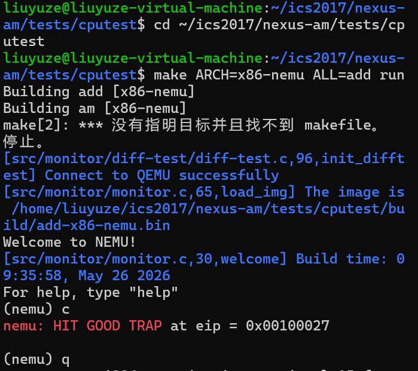
#### 5.2 一键回归测试
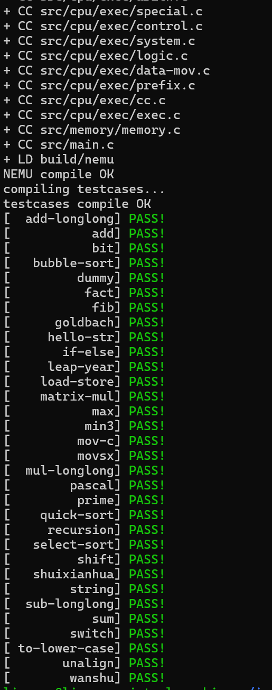
## 阶段三
### 1. 加入IOE
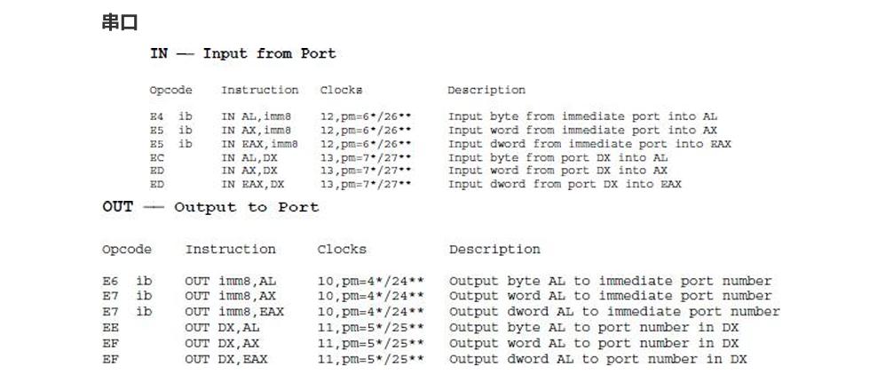

- 打开ioe
>修改common.h
  ```c
  #define HAS_IOE 
  ```
- 打开串口
>修改trm.c
```c
#define HAS_SERIAL
```
- 修改system.c
>in
```c
make_EHelper(in) {
  rtl_li(&t0, pio_read(id_src->val, id_dest->width));
  operand_write(id_dest, &t0);
  print_asm_template2(in);

#ifdef DIFF_TEST
  diff_test_skip_qemu();
#endif
}
```
>out
```c
make_EHelper(out) {
  pio_write(id_dest->val, id_src->width, id_src->val);
  print_asm_template2(out);

#ifdef DIFF_TEST
  diff_test_skip_qemu();
#endif
}
```
- 修改exec.c
```c
  /* 0xe4 */  IDEX(I, in), IDEX(I, in), IDEX(I, out), IDEX(I, out),
  /* 0xe8 */  IDEX(J, call), IDEX(J, jmp), IDEX(I, jmp_rm), IDEXW(J, jmp, 1),
  /* 0xec */  IDEX(I, in), IDEX(I, in), IDEX(I, out), IDEX(I, out),
``` 

#### 1.2 测试

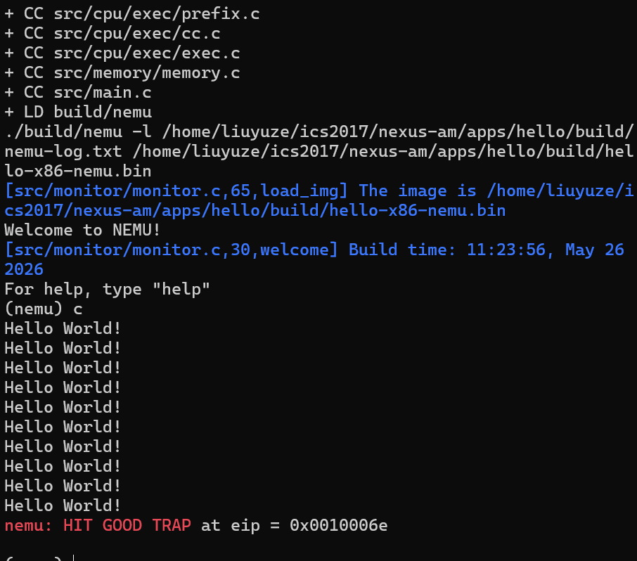

### 2. 时钟
#### 2.1 指令实现
- 修改ioe.c
```c
unsigned long _uptime() {
  return inl(RTC_PORT) - boot_time;
}
```

#### 2.2 测试
- 时钟测试
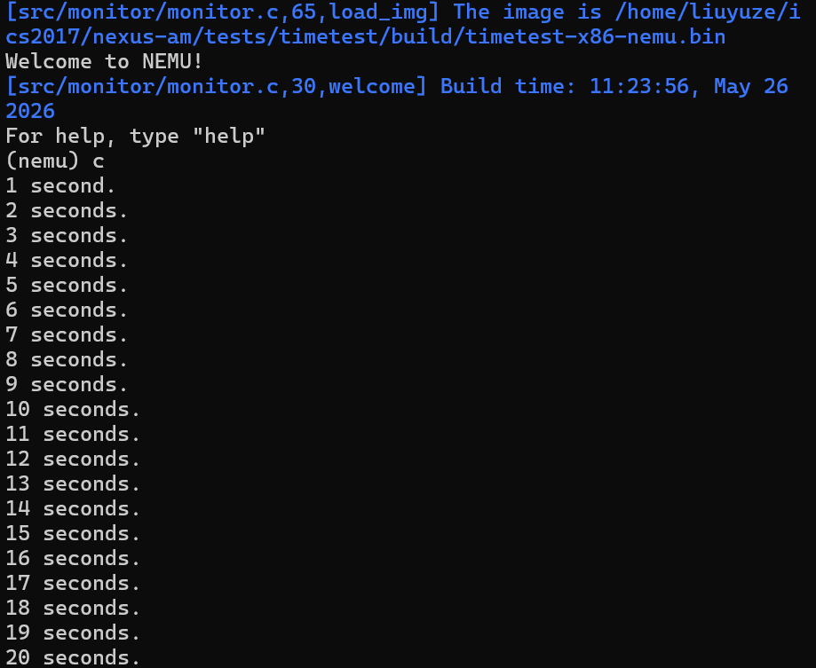
- 跑分测试
>Dhrystone
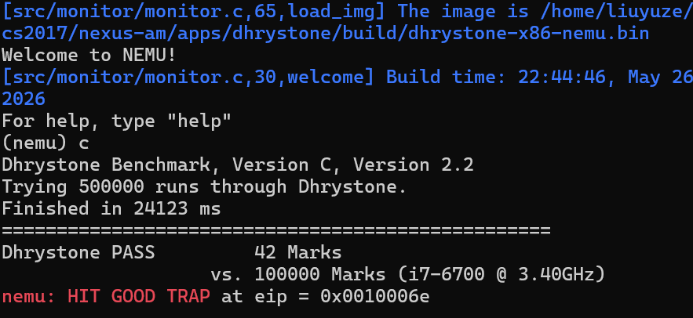
### 3. 键盘
#### 3.1 指令实现
- 修改ioe.c
```c
int _read_key() {
  if (inb(0x64)) {
    return inl(0x60);
  }
  return _KEY_NONE;
}
```
#### 3.2 测试
- 键盘测试
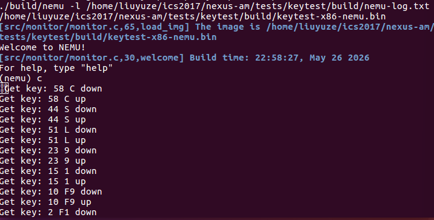

### 4. VGA
#### 4.1 指令实现
- 修改memory.c
>paddr_read
```c
uint32_t paddr_read(paddr_t addr, int len) {
    int r=is_mmio(addr);
    if(r==-1)
        return pmem_rw(addr, uint32_t) & (~0u >> ((4 - len) << 3));
    else
        return mmio_read(addr,len,r);
}
```
>paddr_write
```c
void paddr_write(paddr_t addr, int len, uint32_t data) {
    int r=is_mmio(addr);
    if(r==-1)
        memcpy(guest_to_host(addr), &data, len);
    else
        mmio_write(addr,len,data,r);
}
```
- 修改ioe.c
>_draw_rect
```c
void _draw_rect(const uint32_t *pixels, int x, int y, int w, int h) {
    int temp = (w > _screen.width - x) ? _screen.width - x : w;
    int cp_bytes = sizeof(uint32_t) * temp;
    for (int j = 0; j < h && y + j < _screen.height; j++) {
        memcpy(&fb[(y + j) * _screen.width + x], pixels, cp_bytes);
        pixels += w;
    }
}
```
#### 4.2 测试
- VGA测试

- 打字游戏
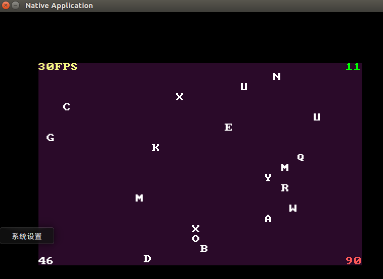


## 必答题
### 1. static inline
#### 1.1 先在rtl.h进行测试
>去掉 static，保留 inline
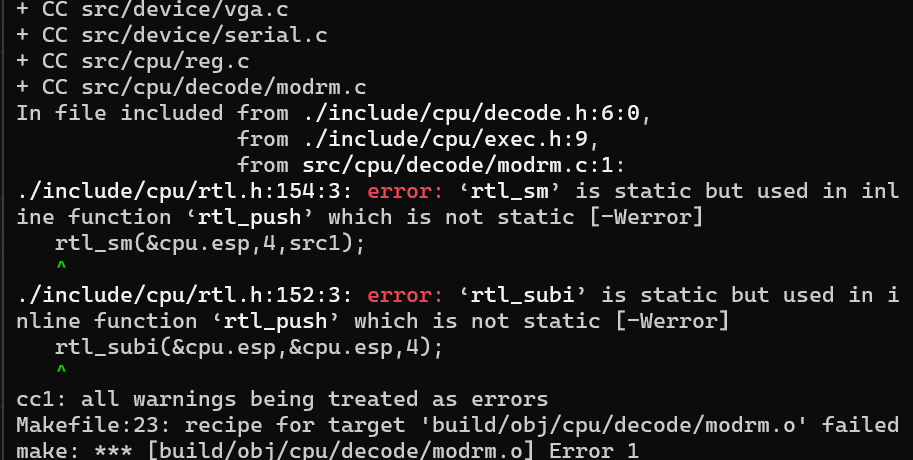
去掉 static 后，函数变成外部链接，但其他被调用的函数仍是内部链接，导致链接性不匹配。
>去掉 inline，保留 static
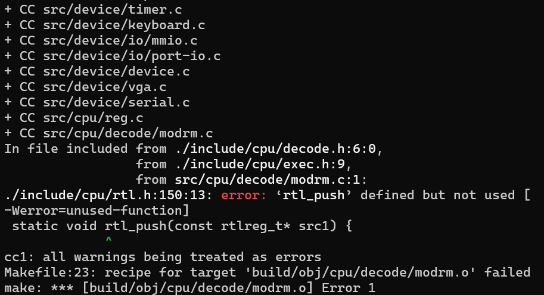
去掉 inline 后，函数变成普通 static 函数。如果某个编译单元包含了头文件但没有调用该函数，就会报 "unused-function" 警告。
>去掉 static，去掉 inline
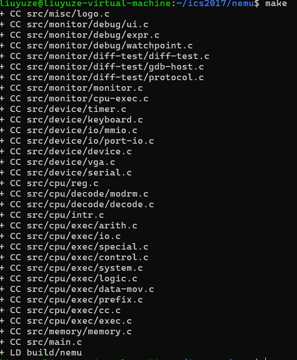
成功编译
#### 1.2 原理分析
##### 1.2.1 static 与 inline 的作用

*tatic —— 链接性控制*

`static` 用于函数定义时，赋予该函数**内部链接性（internal linkage）**：
- 该函数只在当前编译单元内可见，不同编译单元可以定义同名 static 函数而互不干扰
- 链接器不会将 static 函数暴露为外部符号

*inline —— 内联建议*

`inline` 是**建议性**关键字，告诉编译器尝试在调用点直接展开函数体，消除函数调用开销。但编译器可以选择忽略这个建议。

##### 1.2.2 核心问题：链接性冲突

*为什么 inline 不能调用 static*

具有外部链接性的 `inline` 函数，理论上可被任何编译单元内联展开。如果它调用了一个 `static` 函数，内联者需要访问该 static 函数，但 static 函数仅对定义它的编译单元可见——链接性不匹配，编译器报错。

*为什么 static（无 inline）会报警告*

去掉 `inline` 后，编译器必须为每个 static 函数生成独立代码。如果某个编译单元包含了函数定义却未使用，编译器会发出 "unused-function" 警告。NEMU 的 Makefile 开启了 `-Werror`，将警告视为错误，导致编译终止。

*为什么普通函数（无 static 无 inline）理论上会冲突*

具有外部链接性的函数在程序中只能有一个定义。`rtl.h` 被多个 `.c` 文件包含，每个都定义了一份同名函数，违反 ODR，链接器应报 `multiple definition` 错误。


### 2. 了解Makefile请描述你在nemu目录下敲入make后,make程序如何组织.c和.h文件,最终生成可执行文件

#### 2.1 Makefile 的工作方式

```makefile
NAME = nemu
INC_DIR += ./include
BUILD_DIR ?= ./build
OBJ_DIR ?= $(BUILD_DIR)/obj
BINARY ?= $(BUILD_DIR)/$(NAME)

include Makefile.git
.DEFAULT_GOAL = app

CC = gcc
LD = gcc
INCLUDES  = $(addprefix -I, $(INC_DIR))
CFLAGS   += -O2 -MMD -Wall -Werror -ggdb $(INCLUDES)

SRCS = $(shell find src/ -name "*.c")
OBJS = $(SRCS:src/%.c=$(OBJ_DIR)/%.o)

$(OBJ_DIR)/%.o: src/%.c
	@echo + CC $<
	@mkdir -p $(dir $@)
	@$(CC) $(CFLAGS) -c -o $@ $<

-include $(OBJS:.o=.d)

$(BINARY): $(OBJS)
	$(call git_commit, "compile")
	@echo + LD $@
	@$(LD) -O2 -o $@ $^ -lSDL2 -lreadline
```

##### 2.1.1 变量定义与展开

Makefile 首先定义了一系列变量：

| 变量 | 值 | 作用 |
|------|---|------|
| `NAME` | `nemu` | 项目名称 |
| `INC_DIR` | `./include` | 头文件搜索目录 |
| `BUILD_DIR` | `./build` | 构建输出目录 |
| `OBJ_DIR` | `./build/obj` | 目标文件存放目录 |
| `BINARY` | `./build/nemu` | 最终可执行文件路径 |
| `CC` | `gcc` | C 编译器 |
| `LD` | `gcc` | 链接器（复用 gcc） |
| `CFLAGS` | `-O2 -MMD -Wall -Werror -ggdb -I./include` | 编译选项 |
| `SRCS` | `$(shell find src/ -name "*.c")` | 所有源文件列表 |
| `OBJS` | `$(SRCS:src/%.c=$(OBJ_DIR)/%.o)` | 所有目标文件列表 |

其中 `SRCS` 使用 `$(shell find src/ -name "*.c")` 自动查找 `src/` 下所有 `.c` 文件，然后通过**替换引用** `$(SRCS:src/%.c=$(OBJ_DIR)/%.o)` 将路径从 `src/xxx.c` 映射为 `build/obj/xxx.o`。

##### 2.1.2 `include` 指令 —— 复用公共规则

```makefile
include Makefile.git
```

Makefile 通过 `include` 将 `Makefile.git` 包含进来。`Makefile.git` 中定义了 `git_commit` 函数（用于自动提交编译记录），实现了规则的复用。

##### 2.1.3 模式规则（Pattern Rule）—— 如何从 `.c` 编译 `.o`

```makefile
$(OBJ_DIR)/%.o: src/%.c
	@echo + CC $<
	@mkdir -p $(dir $@)
	@$(CC) $(CFLAGS) -c -o $@ $<
```

这是 Makefile 的核心编译规则，使用 `%` 通配符进行模式匹配：

- **匹配过程**：当 Make 需要构建 `build/obj/cpu/exec/arith.o` 时，`%` 匹配 `cpu/exec/arith`，对应的源文件为 `src/cpu/exec/arith.c`
- **自动变量**：
  - `$@` = 目标文件（`build/obj/cpu/exec/arith.o`）
  - `$<` = 第一个依赖文件（`src/cpu/exec/arith.c`）
  - `$(dir $@)` = 目标文件所在目录（`build/obj/cpu/exec/`）
- **`mkdir -p $(dir $@)`**：自动创建目标文件所需的目录结构
- **`@` 前缀**：抑制命令回显（Make 只显示 `echo + CC $<` 的输出）

实际展开后的命令（来自 `make -n` 输出）：
```bash
echo + CC src/cpu/exec/arith.c
mkdir -p build/obj/cpu/exec/
gcc -O2 -MMD -Wall -Werror -ggdb -I./include -c -o build/obj/cpu/exec/arith.o src/cpu/exec/arith.c
```

##### 2.1.4 依赖文件（.d）机制 —— 增量编译

```makefile
-include $(OBJS:.o=.d)
```

编译选项中的 `-MMD` 标志让 gcc 在编译 `.c` → `.o` 的同时自动生成 `.d` 依赖文件。例如编译 `arith.c` 时会生成 `build/obj/cpu/exec/arith.d`，内容类似：

```makefile
build/obj/cpu/exec/arith.o: src/cpu/exec/arith.c \
  ./include/cpu/exec.h ./include/cpu/rtl.h \
  ./include/nemu.h ./include/common.h ...
```

`.d` 文件记录了每个 `.o` 文件依赖哪些 `.c` 和 `.h` 文件。`-include` 前缀的 `-` 表示"文件不存在也不报错"。

**增量编译的工作原理**：
1. 修改了 `rtl.h` → Make 读取所有 `.d` 文件，发现 `arith.o`、`logic.o` 等都依赖 `rtl.h`
2. Make 检查 `rtl.h` 的时间戳比这些 `.o` 文件新
3. Make 只重新编译受影响的 `.o` 文件，而非全部重新编译

##### 2.1.5 链接规则 —— 生成最终可执行文件

```makefile
$(BINARY): $(OBJS)
	$(call git_commit, "compile")
	@echo + LD $@
	@$(LD) -O2 -o $@ $^ -lSDL2 -lreadline
```

- `$^` = 所有依赖文件（即全部 `.o` 文件列表）
- `-lSDL2 -lreadline` = 链接 SDL2 图形库和 readline 库
- 链接前先调用 `git_commit` 自动提交编译记录

实际展开后的命令（来自 `make -n` 输出）：
```bash
git add .. -A --ignore-errors
(echo ">  "compile" && echo 2411334 && id -un && uname -a && uptime && ...) | git commit -F - -q ...
echo + LD build/nemu
gcc -O2 -o build/nemu build/obj/misc/logo.o build/obj/monitor/debug/ui.o ... build/obj/main.o -lSDL2 -lreadline
```

---

##### 2.2 从 `make` 到 `nemu/build/nemu` 的完整编译/链接过程

根据 `make -n` 的实际输出，完整的构建流程如下：

```
[阶段 0: make 启动]
  ↓
读取 Makefile，展开变量：
  NAME = nemu, CC = gcc, CFLAGS = -O2 -MMD -Wall -Werror -ggdb -I./include
  include Makefile.git（引入 git_commit 函数）
  ↓
执行 SRCS = $(shell find src/ -name "*.c")
  找到 src/ 下所有 .c 文件（共 30 个）
  ↓
执行 OBJS = $(SRCS:src/%.c=$(OBJ_DIR)/%.o)
  将源文件路径映射为目标文件路径
  ↓
找到默认目标 app → 依赖 $(BINARY) = build/nemu
  ↓
build/nemu 依赖所有 30 个 .o 文件
  ↓
检查每个 .o 是否需要重建（比较 .c/.h 与 .o 的时间戳）
  ↓
┌─────────────────────────────────────────────────────────┐
│ 对每个需要重建的 .c 文件，执行以下步骤（共 30 次）：    │
└─────────────────────────────────────────────────────────┘

[阶段 1: 创建目录]
  mkdir -p build/obj/<对应子目录>/

[阶段 2: 编译 .c → .o（gcc -c 一步完成预处理+编译+汇编）]
  gcc -O2 -MMD -Wall -Werror -ggdb -I./include -c -o build/obj/xxx.o src/xxx.c
  │
  ├── 预处理：展开 #include（rtl.h, exec.h, nemu.h 等）、#define
  ├── 编译：将 C 代码翻译为汇编
  ├── 汇编：将汇编翻译为机器码
  └── 生成 .d 依赖文件（-MMD 选项）

  实际编译的 30 个文件（按 make -n 输出顺序）：
  1.  src/misc/logo.c
  2.  src/monitor/debug/ui.c
  3.  src/monitor/debug/expr.c
  4.  src/monitor/debug/watchpoint.c
  5.  src/monitor/diff-test/diff-test.c
  6.  src/monitor/diff-test/gdb-host.c
  7.  src/monitor/diff-test/protocol.c
  8.  src/monitor/monitor.c
  9.  src/monitor/cpu-exec.c
  10. src/device/timer.c
  11. src/device/keyboard.c
  12. src/device/io/mmio.c
  13. src/device/io/port-io.c
  14. src/device/device.c
  15. src/device/vga.c
  16. src/device/serial.c
  17. src/cpu/reg.c
  18. src/cpu/decode/modrm.c
  19. src/cpu/decode/decode.c
  20. src/cpu/intr.c
  21. src/cpu/exec/arith.c
  22. src/cpu/exec/io.c
  23. src/cpu/exec/special.c
  24. src/cpu/exec/control.c
  25. src/cpu/exec/system.c
  26. src/cpu/exec/logic.c
  27. src/cpu/exec/data-mov.c
  28. src/cpu/exec/prefix.c
  29. src/cpu/exec/cc.c
  30. src/cpu/exec/exec.c
  31. src/memory/memory.c
  32. src/main.c

[阶段 3: git 自动提交]
  git add .. -A --ignore-errors
  git commit -m "compile" --author='tracer-ics2017 <tracer@njuics.org>'

[阶段 4: 链接所有 .o → 可执行文件]
  gcc -O2 -o build/nemu \
    build/obj/misc/logo.o \
    build/obj/monitor/debug/ui.o \
    build/obj/monitor/debug/expr.o \
    ...（共 30 个 .o 文件）...
    build/obj/main.o \
    -lSDL2 -lreadline

  链接器完成：
  ├── 合并所有 .o 文件的代码段（.text）和数据段（.data/.bss）
  ├── 解析符号引用（将函数调用与函数定义关联）
  ├── 重定位（调整地址，使各模块正确引用彼此）
  └── 链接外部库（libSDL2.so、libreadline.so）

[输出]
  build/nemu（ELF 可执行文件）
```


